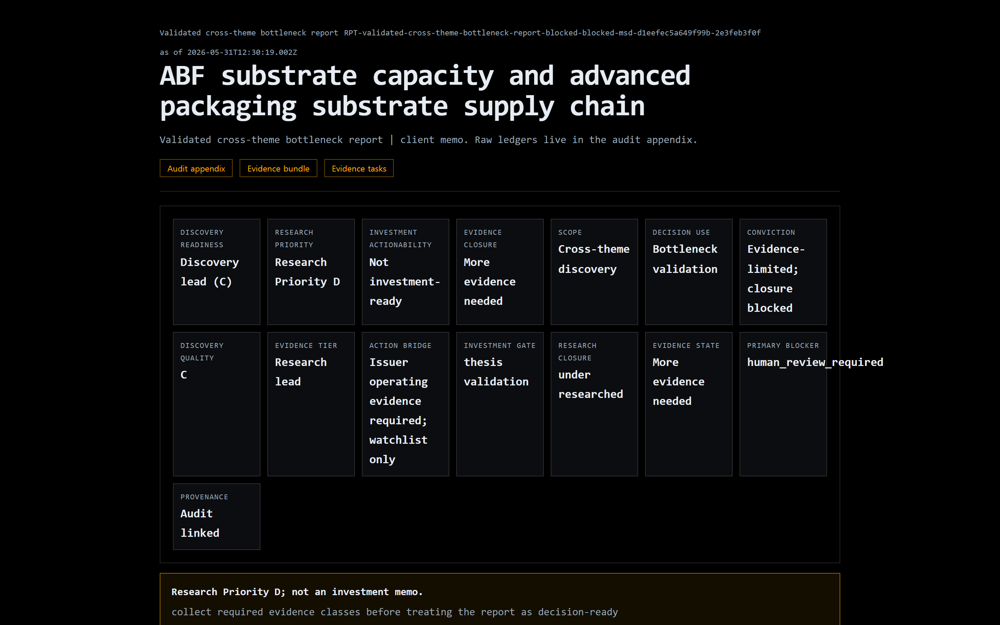
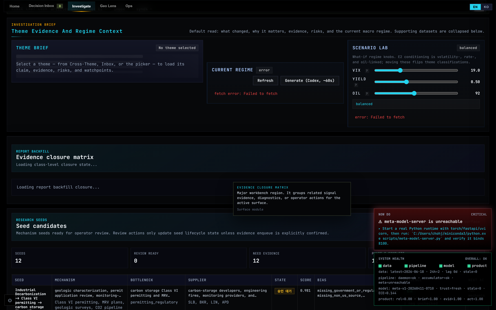
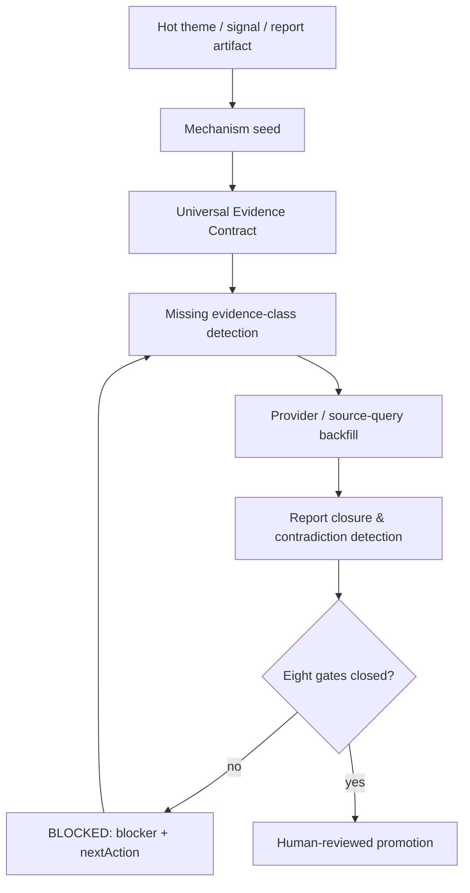
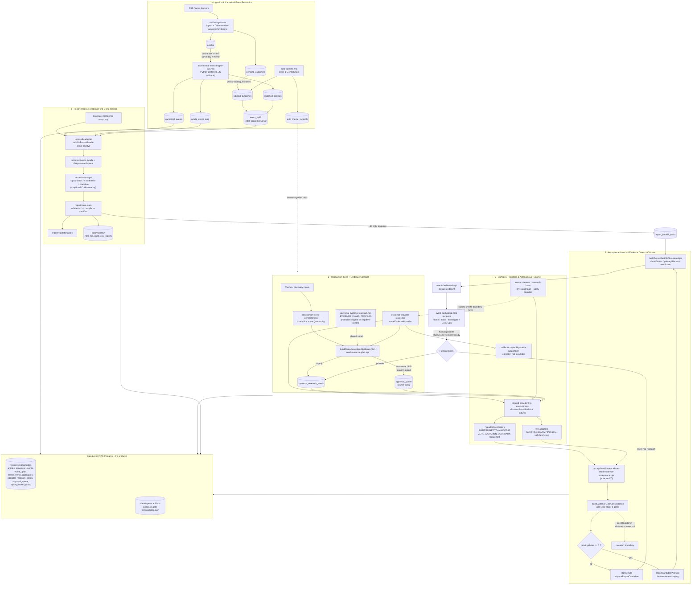
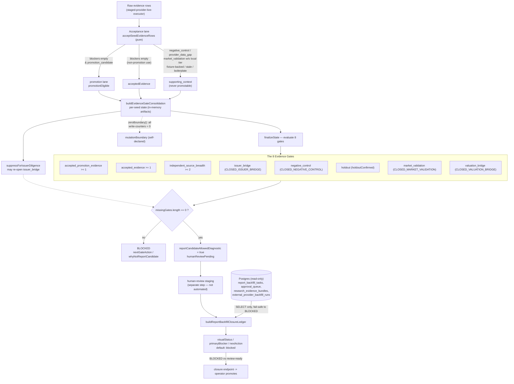

# Lattice Current

**Lattice is a local-first, evidence-gated research OS that blocks confident-looking reports until the evidence is actually there.**

> 한 줄 요약: Lattice는 로컬에서 도는 증거-게이트 리서치 도구입니다. 증거가 실제로 갖춰지기 전까지 보고서를 `BLOCKED` 상태로 묶어 둡니다.

[](https://www.gnu.org/licenses/agpl-3.0)
[](https://www.typescriptlang.org/)
[](https://cheesss.github.io/lattice-current/)



## The problem, and the idea

Generating an AI research report is easy. Knowing when one is *not ready* is the hard part, and most tools skip it — they hand you a confident-looking memo whether or not the evidence underneath it exists.

Lattice makes "not ready" a first-class output. A thesis cannot be promoted until issuer exposure, market validation, negative controls, source breadth, and accepted evidence actually exist. Until then the report stays `BLOCKED` and names the gate that is missing.

## What it does

- **"Not ready" is a named output, not a silent failure.** A report sits in `BLOCKED` / needs-fix with an explicit blocker and next-action until eight evidence gates close: accepted promotion evidence, accepted evidence, independent source breadth, issuer bridge, negative control, holdout, market validation, and valuation bridge. The gate roll-up — missing-gate detection and the next-action it points to — is computed in `scripts/_shared/evidence-gate-consolidator.mjs` (the per-class `primaryBlocker` / `visualStatus` ledger lives in `scripts/_shared/report-backfill-closure.mjs`).
- **Raw evidence can't quietly become promotion evidence.** Every collected row must clear an acceptance lane — staleness, duplicate, generic-boilerplate, fixture-only, issuer-bridge — and the negative-control and market-validation classes are hard-coded as non-promotion or local-controlled-only. See `scripts/_shared/seed-evidence-acceptance.mjs`.
- **Every report carries a Universal Evidence Contract.** It enumerates which evidence classes are required and which are promotion-eligible (`promotionEligible` per class), so "what is still missing" is a concrete per-class list, not a vibe. See `scripts/_shared/universal-evidence-contract.mjs`.



## Run it locally

Full local stack (Postgres + pgvector via Docker, zero API keys):

```bash
docker compose up -d        # local Postgres + pgvector
npm run demo:seed           # schema + demo data + a DB-backed report, zero keys
npm run dev                 # open the dashboard
```

No database, no keys, one command — generates a full evidence-first report (`report.html` + audit appendix + `evidence_table.csv`):

```bash
npm run report:deep -- --type theme_report --subject "AI / Machine Learning"
```

> **Status:** the no-DB report path is verified working. The local-DB path is verified end-to-end against a real Postgres engine — the schema and seed apply cleanly, `generate-intelligence-report --db` produces a report (exit 0), and the research-seeds panel populates; re-running is idempotent. Not yet captured: a screenshot walkthrough of `npm run dev` in a browser. (The bundled image is `pgvector/pgvector:pg16`; verification used a vanilla Postgres engine, since the theme-report path does not query embeddings.)

> **Boundary:** report generation and the dashboard panels run locally with zero keys. *Live* external news ingestion is an optional "go further" step that additionally needs free Guardian/NYT keys and a local Ollama embedding model — it is not part of the default demo.

## What this is NOT (on purpose)

These are deliberate boundaries. The conservative gates *are* the product.

- Not an investment adviser, stock picker, alpha guarantee, or fully-automated decision system.
- Not a live backtesting product. The backtest/ML modules live on the `legacy/backtest` branch; replay is not a feature here.
- Not autonomous trading or auto-promotion. Every autonomous loop keeps readiness/candidate/portfolio writes at 0 — a human promote is always required.
- Market validation is not durable alpha. It only reaches decision-grade from local controlled event data, and it is explicitly caveated as such.
- Source breadth is modest by design: the gate threshold is `>= 2` independent sources. We don't claim more.

## The research loop



## The hero artifact: a real BLOCKED report

A real `BLOCKED` report already lives in the repo at
`data/reports/RPT-validated-cross-theme-bottleneck-report-blocked-*/report.html`.
Its banner reads *"Research Priority D; not an investment memo — collect required evidence classes before treating the report as decision-ready"*, and its **"Why Not Review-Ready Yet"** section names the exact missing gates (`negative_control`, `controlled_market_validation`, `issuer_bridge`, `holdout_validation`). Dozens of sibling `RPT-...-blocked-*` folders (53 in this repo) show that blocking is the norm, not a staged one-off — it inverts the usual confident-AI-buy-signal demo.

---

## Architecture

Lattice spans five layers — ingestion & canonical events, mechanism seeds + evidence contracts, the acceptance lane + eight evidence gates, the report pipeline, and the operator surfaces — over Postgres plus filesystem report artifacts. Full writeup, the core data model, and an honest list of what it deliberately does **not** claim are in **[docs/ARCHITECTURE.md](docs/ARCHITECTURE.md)**.





## Primary entry surface

The canonical product entry is the theme shell:

- `/` redirects to `/event-dashboard.html`
- `event-dashboard.html` is the main surface for live signals, theme briefs, the 2D Geo Lens, Codex proposal review, approval handling, validation snapshots, and operator diagnostics
- the old main page is retired from the user entry flow and kept only as legacy source material while remaining functionality is absorbed

The heavy backtest-ML modules were removed from the main branch and preserved on `legacy/backtest`.

## Theme shell surfaces

- `Theme Brief`: the main evidence-backed reading surface for the selected theme or signal
- `2D Geo Lens`: flat map surface with legacy risk-region, infrastructure, and event overlays preserved without the globe-first UI
- `Proposal Inbox`: Codex-suggested sources, themes, and exposures with accept or reject review in place
- `Approval Queue`: human-gated actions that execute directly from the shell once accepted
- `Research Seeds`: mechanism seed candidates with score, bias/source-gap audit, evidence plan, and guarded review actions
- `Provider Gap Review`: review-gated proposals for missing DART, EDINET, TDnet, EU TED, patent, grid queue, and trade-media coverage
- `Report Backfill Closure`: evidence contract matrix, provider route, latest run, tier, blocker, next action, and contradiction warnings
- `Signal And Validation Snapshots`: compact risk, macro, investment, and replay surfaces kept inside the same operator loop
- `Operator Diagnostics`: automation telemetry, system health, data quality, and Codex quality

The same repository powers multiple variants:

- `full`: geopolitics, conflict, infrastructure, intelligence
- `tech`: AI, startups, cloud, cyber, technology ecosystems
- `finance`: markets, macro, central banks, commodities, cross-asset analysis

## Execution boundary

The repository follows a workload split instead of forcing all compute through one language:

- TypeScript: browser UI, API handlers, schedulers, ingestion, desktop shell
- Python: canonical-event clustering, abnormal-return analytics, model training, and future heavy batch analytics
- Rust: Tauri runtime only, with optional future hot-loop acceleration

Batch compute writes results to PostgreSQL so frontend and API code can consume stable outputs without importing Python directly.

## Repository structure

- `src/`: app shell, panels, services, analysis logic
- `server/`: API handlers and domain services
- `src-tauri/`: desktop runtime and local sidecar
- `docs/`: technical reference and deep-dive docs
- `site/`: GitHub Pages documentation site
- `scripts/`: report generation, evidence backfill, mechanism seed lifecycle, provider gap review, daemon tasks, build tooling, and Python-first batch compute entrypoints

## Getting started

Prerequisites: Node 20+ (developed on Node 24) and, for the full local demo, Docker.

```bash
npm install
```

### Run the full demo locally (database included)

Lattice's pipeline, DB-backed reports, and dashboard panels run on Postgres. A
self-contained local database is bundled via Docker, so anyone can run the full
stack with no NAS and no API keys:

```bash
docker compose up -d     # start Postgres + pgvector on 127.0.0.1:5432
npm run demo:seed        # create schema + load demo data + a DB-backed report
npm run dev              # open the printed dashboard URL
```

`npm run demo:seed` is idempotent and zero-config: with nothing set it targets the
bundled database above. To point at a different local Postgres, copy `.env.example`
to `.env.local` and set the one-line `DATABASE_URL` (or `LATTICE_PG_*`). The tooling
refuses to run against a non-local host, so it can never touch a production database.

Stop the database with `docker compose down` (add `-v` to also delete its data volume).

### Run without a database

`npm run dev` also boots without Postgres (DB-backed panels degrade gracefully), and
you can generate a complete, real evidence-first report from built-in sample evidence
with no database and no keys:

```bash
npm run report:deep -- --type theme_report --subject "AI / Machine Learning"
# -> writes data/reports/<id>/report.html + audit appendix + evidence table
```

`npm run dev` starts the integrated theme-shell stack: the event dashboard API plus
the Vite frontend. The root path `/` redirects to the theme shell automatically.

Optional Python compute setup:

```bash
python -m pip install -r scripts/requirements-compute.txt
```

Other common commands:

```bash
npm run dev:full
npm run dev:tech
npm run dev:finance
npm run typecheck
npm run build
npm run docs:dev
npm run docs:build
npm run report:deep:db -- --type cross_theme_bottleneck_report --subject "solid rocket motor capacity"
node --import tsx scripts/run-mechanism-seed-generation.mjs --dry-run --plan-evidence --limit 25
node --import tsx scripts/run-evidence-contract-backfill-cycle.mjs --latest --passes 1 --limit 10
npm run canonical:build -- --dry-run
npm run returns:abnormal -- --dry-run
npm run public:sync:dry
npm run public:sync
```

## Documentation

- Technical docs index: [docs/DOCUMENTATION.md](docs/DOCUMENTATION.md)
- Report generator plan: [docs/INTELLIGENCE_REPORT_GENERATOR_PLAN_2026-05-06.md](docs/INTELLIGENCE_REPORT_GENERATOR_PLAN_2026-05-06.md)
- Report output layer: [docs/REPORT_OUTPUT_LAYER_OVERHAUL_2026-05-09.md](docs/REPORT_OUTPUT_LAYER_OVERHAUL_2026-05-09.md)
- Report handoff: [docs/INTELLIGENCE_REPORT_HANDOFF_2026-05-07.md](docs/INTELLIGENCE_REPORT_HANDOFF_2026-05-07.md)
- User guide: [docs/USER_GUIDE.md](docs/USER_GUIDE.md)
- Architecture: [docs/ARCHITECTURE.md](docs/ARCHITECTURE.md)
- Algorithms: [docs/ALGORITHMS.md](docs/ALGORITHMS.md)
- AI and intelligence: [docs/AI_INTELLIGENCE.md](docs/AI_INTELLIGENCE.md)
- Decision-support playbook: [docs/investment-usage-playbook.md](docs/investment-usage-playbook.md)
- Public sync workflow: [docs/public-sync.md](docs/public-sync.md)
- Automation runbook: [docs/automation-runbook.md](docs/automation-runbook.md)
- Script operations guide: [scripts/README.md](scripts/README.md)
- Launch & positioning: [docs/marketing/](docs/marketing/)

## Naming note

This repository is branded as `Lattice Current`.

Some deep technical documents and inherited storage keys still contain older internal identifiers. They reflect implementation lineage, not the public product name.

## Licensing and content policy

The repository uses separate policies for code and content:

- Code license: [AGPL-3.0-only](LICENSE)
- Copyright policy: [COPYRIGHT.md](COPYRIGHT.md)
- Content and screenshot policy: [CONTENT_POLICY.md](CONTENT_POLICY.md)
- Third-party notices: [THIRD_PARTY_NOTICES.md](THIRD_PARTY_NOTICES.md)
- Trademarks: [TRADEMARKS.md](TRADEMARKS.md)

## Contribution rule

If a change affects user-facing behavior, public APIs, product capabilities, or workflows, update either:

- a feature page, or
- an update note

See [CONTRIBUTING.md](CONTRIBUTING.md) for contribution expectations.
