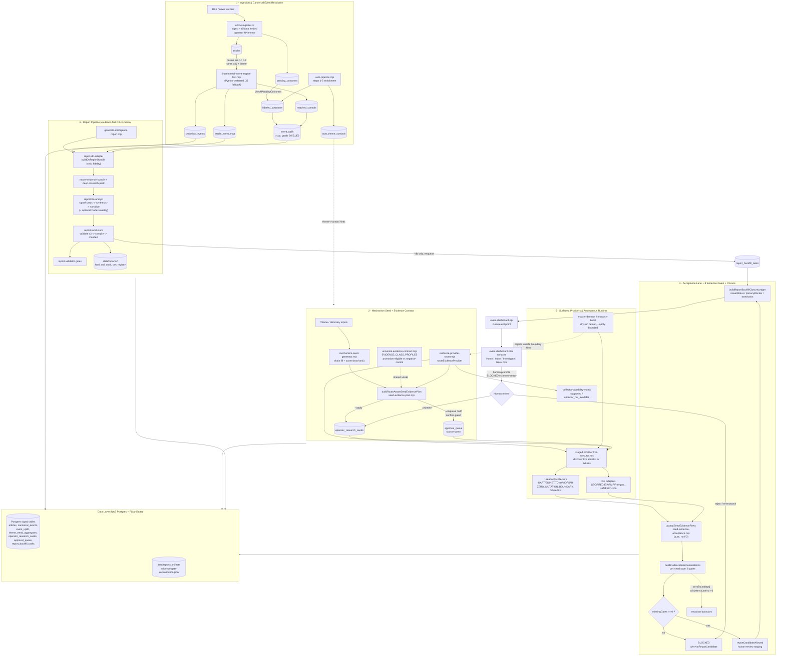
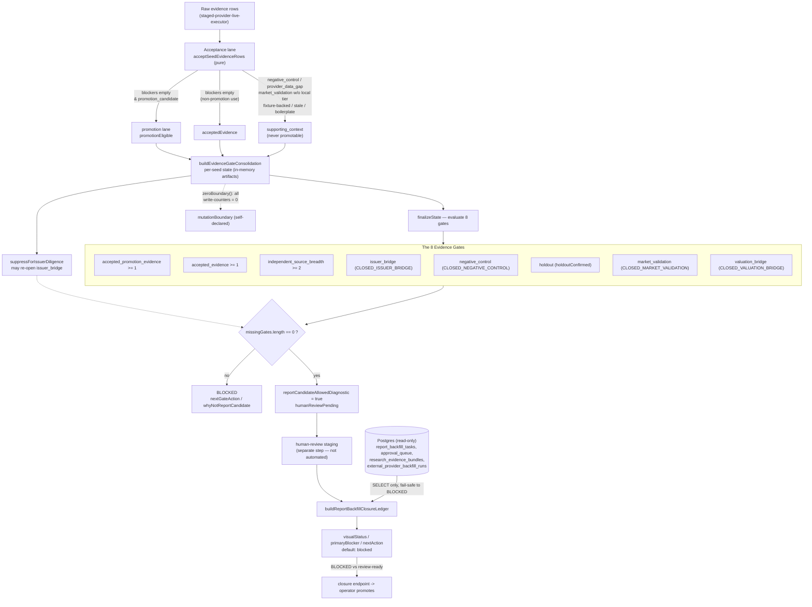
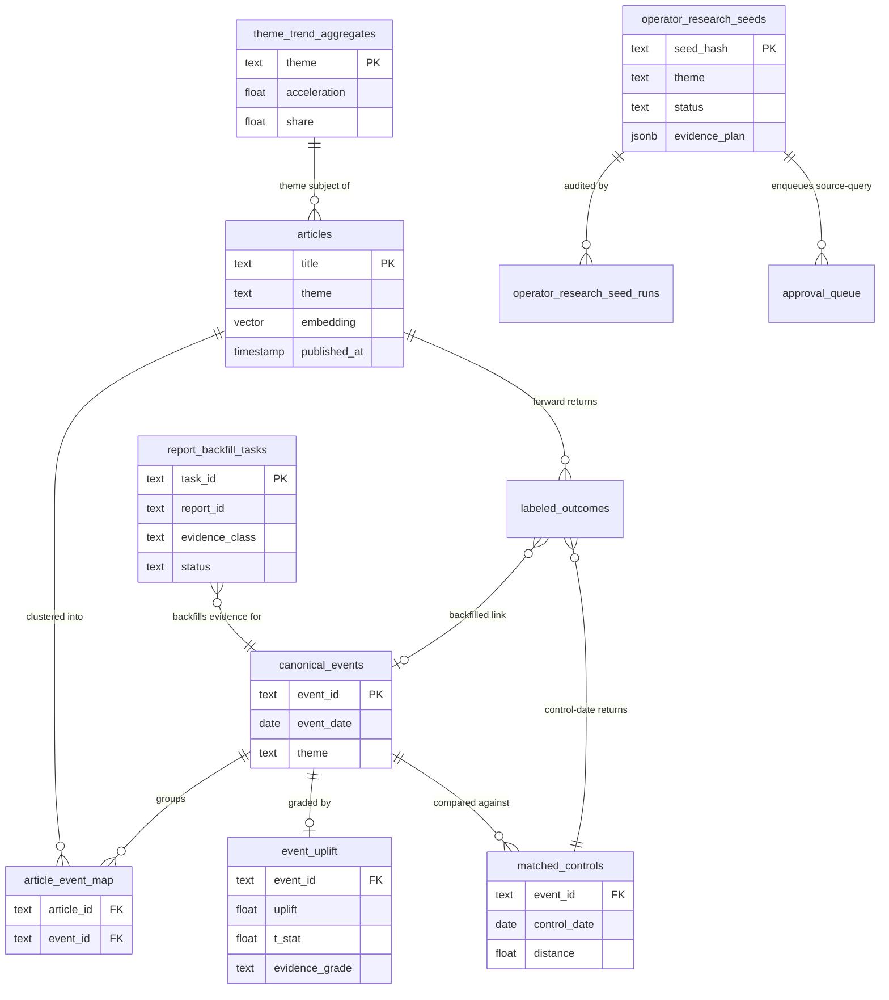

# Lattice Current — Architecture

Lattice Current is an evidence-first event-decision engine. It turns raw news into deduplicated, statistically-graded events, attaches a per-class evidence contract to each investigable mechanism, collects evidence through a read-only provider runtime, and refuses to surface any report as a candidate until a sequence of evidence gates closes and a human promotes it. The system spans five layers over a NAS Postgres database plus filesystem report artifacts.

**1. Ingestion & Canonical Event Resolution.** `article-ingestor.ts` ingests RSS/news articles into `articles` (deduped by title), generates an Ollama (`nomic-embed-text`) embedding, and auto-classifies a theme via pgvector nearest-neighbor against labeled anchors. `auto-pipeline.mjs` performs upstream enrichment (theme→symbol mapping, `labeled_outcomes`, sensitivity matrix) but never creates events. The wired `incremental-event-engine-fast.mjs` (Python-preferred, JS fallback) clusters same-day/same-theme articles by cosine similarity (≥0.7) into `canonical_events` with an `article_event_map` join, then computes `event_features`, `matched_controls`, and a date-matched-control `event_uplift` t-stat graded E0/E1/E2.

**2. Mechanism Seed + Evidence Contract.** `mechanism-seed-generator.mjs` deterministically expands a theme into a scored mechanism chain (Growth Driver → Real Activity → Physical Process → Required Input → Bottleneck → Supplier → Evidence/Counter-evidence) — read-only, zero DB writes. `seed-evidence-plan.mjs` routes each required evidence class via `evidence-provider-router.mjs` into source-query drafts; under `--apply` it persists `operator_research_seeds`, and only under explicit enqueue/API confirmation does it INSERT `source-query` rows into `approval_queue`. `universal-evidence-contract.mjs` supplies the shared evidence-class taxonomy (promotion-eligible vs negative-control/non-promotion) used at report time.

**3. Acceptance Lane + 8 Evidence Gates + Closure.** This is the honesty boundary. A pure acceptance lane (`seed-evidence-acceptance.mjs`) scores each raw row and forces `negative_control`, `provider_data_gap`, fixture-backed, and untiered `market_validation` into non-promotion supporting use. `evidence-gate-consolidator.mjs` folds accepted/promotion rows into per-seed state and evaluates **eight gates** — accepted_promotion_evidence, accepted_evidence, independent_source_breadth (≥2), issuer_bridge, negative_control, holdout, market_validation, valuation_bridge. A report stays **BLOCKED** until `missingGates` is empty, and even then is only *staged* for human review. Every output carries a self-declared `zeroBoundary()` (all write-counters = 0); `report-backfill-closure.mjs` reads Postgres read-only and fails safe to BLOCKED.

**4. Report Pipeline.** `generate-intelligence-report.mjs` loads a strict subject-bound bundle (`report-db-adapter.mjs`), synthesizes signal-cards → analyst synthesis → long-form narrative (`report-llm-analyst.mjs`, with an additive optional Codex overlay), then double-validates, compiles, and writes html/md/audit/csv artifacts under `data/reports/<id>/`. Source-query enqueue to `report_backfill_tasks` runs only on the `--db` path.

**5. Surfaces, Providers & Autonomous Runtime.** Five operator surfaces (Home / Decision Inbox / Investigate / Geo Lens / Ops) in `event-dashboard.html` are progressively enhanced by `src/dashboard/surfaces/*` and call read-only JSON endpoints. The provider router maps evidence classes to collectors; `staged-provider-live-executor.mjs` runs `*-readonly` collectors (DART/EDINET/TDnet/MOPS/IR — fixture-first, `ZERO_MUTATION_BOUNDARY`) and live adapters (SEC/FRED/EIA/FMP/Polygon). Daemons and bursts default to dry-run/plan-only; the only operator-triggered DB write is a confirm-gated seed-scoped source-query draft.

### Lattice Current — System Architecture & Data Flow

End-to-end Lattice Current architecture across all five layers. Raw news becomes deduplicated canonical events with matched-control uplift (Layer 1), mechanism seeds carry per-class evidence contracts (Layer 2), the provider runtime collects evidence read-only/fixture-first (Layer 5), an acceptance lane plus eight evidence gates keep every report BLOCKED until a human promotes it (Layer 3), and only then is an evidence-bound memo compiled (Layer 4). All autonomous paths default to read-only/dry-run; the single operator-triggered DB write is a confirm-gated source-query draft.

### Evidence-Gate Pipeline — Acceptance Lane to 8 Gates to BLOCKED/Promote

The honesty boundary in detail. Raw rows pass a pure acceptance lane that forces negative_control, provider_data_gap, fixture-backed, and untiered market_validation into non-promotion supporting use. Surviving rows are consolidated and judged against eight named gates; a report stays BLOCKED until every gate closes, and even then it is only staged for a human to promote. The consolidator writes nothing to the DB (zeroBoundary, self-declared), and the closure ledger reads Postgres read-only, failing safe to BLOCKED when artifacts or DB rows are missing.

### Core Data Model — Events, Uplift, Seeds & Closure

Core relational backbone. Articles are clustered (cosine >= 0.7, same day + theme) into canonical_events via the article_event_map join; each event gets a single event_uplift row (matched-control t-stat graded E0/E1/E2) computed against matched_controls. labeled_outcomes carry forward returns for both event and control samples and are backfilled with a canonical_event_id link. theme_trend_aggregates feeds the report subject row. On the operator side, operator_research_seeds (idempotent by seed_hash, with route-aware evidence_plan) spawn confirm-gated approval_queue source-query drafts and are audited by operator_research_seed_runs, while report_backfill_tasks track per-evidence-class closure for reports.

## What these diagrams deliberately do not claim

Lattice is an evidence-first tool; in that spirit, here is what the architecture above does **not** assert:

- The 'matched-control uplift' (event_uplift) is coarse: controls are matched on DATE (same day-of-week, |Δvix|<=3, |Δyieldspread|<=0.2), NOT on matched symbols or true non-event days for the same symbol. Evidence grades cap at E2 in the engine (E3/E4 referenced by the report adapter are not produced here). The diagrams do not claim this is rigorous matched-control causal inference.
- abnormal_return is a single-factor market model (forward_return minus SPY forward_return). The 'fast' engine hard-codes vix_zscore/vix_momentum/hawkes_momentum to 0 — features shown are a reduced subset, not the full standalone feature set.
- 'Hawkes' intensity is a placeholder counter incremented +1 per article, not a fitted Hawkes process. The naming overstates the math actually present.
- The two cited engine scripts (build-canonical-events.mjs, incremental-event-engine.mjs) are standalone/legacy and NOT wired into automation; the diagrams depict the wired -fast / Python-preferred variants. The destructive full-rebuild (DELETE article_event_map + canonical_events) is the legacy path, not live behavior.
- The zeroBoundary / ZERO_MUTATION_BOUNDARY mutation guards are self-declared assertions (constant objects of zeros), not runtime interceptors of DB writes. Correctness depends on callers respecting them; the acceptance lane is genuinely pure and the consolidator only writes a JSON artifact.
- Autonomous loops keep readiness-promotion, report-candidate, and portfolio-action writes at 0. master-daemon and research-burst default to dry-run/--no-write; --apply enables only bounded execution and still cannot cross provider-activation/canonical/readiness/report-candidate/portfolio boundaries. The single operator DB write is a confirm-gated approval_queue source-query draft plus a seed status flip.
- market_validation is NOT promotable from a source-query and is not durable alpha: it requires local controlled-market data of an accepted tier (decision_grade/screening_grade/weak_screen) and is otherwise demoted to supporting_context. Controlled market validation is a separate, non-source-query step.
- Backtesting / forward returns run on legacy/backtest labeled_outcomes samples (forward_return_pct), not live trading; nothing here claims realized P&L.
- Promotion is never automated by this system. Gates closing only makes a seed eligible (reportCandidateAllowedDiagnostic=true, humanReviewPending); a human reads BLOCKED-vs-review-ready at the closure endpoint and promotes manually.
- The *-readonly collectors are fixture-first by default (DEFAULT_*_FIXTURES) and do not perform their own network fetch; live official-source extraction only happens when the staged executor supplies a discovered live allowlist. They are not live API integrations by default.
- Cold-start fragility: theme auto-classification depends on labeled_outcomes anchors (horizon='2w'); with no anchors theme='unknown', which is filtered out everywhere and never becomes a canonical_event.
- The closure ledger depends heavily on artifact-provided fields; if absent it defaults to evidenceState 'under_researched' / visualStatus 'blocked', and a 'review-ready' shown with a degraded dbContext (db_unreachable/db_access_denied) was computed from artifact data alone.
- The seed-side and report-side evidence contracts are parallel, not a single call chain: the Universal Evidence Contract operates on report bundles (consumed by report-deep-research-pack), while the seed path builds its own per-class plan via the provider router. Two overlapping COMMON_EVIDENCE_CLASSES lists coexist.
- Local source-query enqueue (_source-query-queue.jsonl) is intentionally artifact-only — every draft carries 'canonical source queue integration is intentionally deferred'; there are no live source-registry writes from the report pipeline.
- src/dashboard/surfaces/ contains only shell/decision-inbox/report-backfill/research-seeds enhancers — there are no per-surface home/investigate/geo/ops modules; the five surfaces are nav states in event-dashboard.html, and Geo Lens is a lightweight 2D map iframe, not a primary analytic surface.
