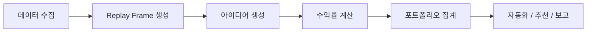
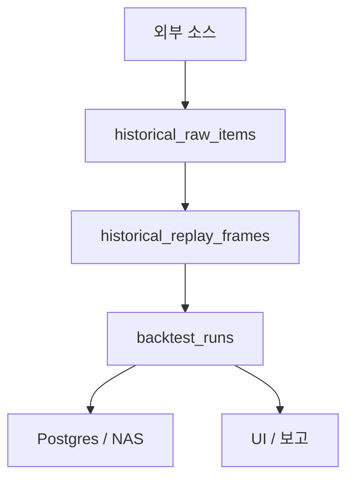

# Backtest Operator Quickstart

작성일: 2026-04-01
대상: 운영자, 리서처, PM

## 이 시스템을 한 줄로 이해하기

이 시스템은 과거의 뉴스와 시장 상황을 당시 시점 기준으로 다시 틀어놓고, 그때 만들었어야 할 투자 아이디어가 실제로 돈이 되었는지를 평가하는 운영형 백테스트 시스템이다.

---

## 1. 운영자가 알아야 할 최소 구조

핵심 해석:

- 데이터는 raw item으로 들어온다
- raw item은 frame으로 묶인다
- frame에서 이벤트와 아이디어가 만들어진다
- 아이디어의 미래 수익률이 계산된다
- 개별 결과가 포트폴리오 성과로 다시 집계된다

---

## 2. 꼭 알아야 할 용어

- `frame`: 특정 시점까지 알 수 있었던 정보 묶음
- `knowledgeBoundary`: 그 시점에 볼 수 있는 정보의 상한선
- `warmup`: 평가보다 상태 예열용 구간
- `idea card`: 테마 기반 투자 아이디어 표현
- `idea run`: 실제 수익률 평가 대상으로 남은 아이디어
- `forward return`: 아이디어 생성 후 미래 성과
- `portfolio snapshot`: 포트폴리오 수준 성과 요약

---

## 3. 운영자가 결과를 볼 때 순서

1. 데이터셋 상태를 본다
2. replay run이 정상 생성되었는지 본다
3. idea 수와 채택률을 본다
4. raw return보다 cost-adjusted return을 우선 본다
5. 포트폴리오 CAGR, Sharpe, max drawdown을 함께 본다
6. adaptation이 최근 구간에서 지나치게 편향되지 않았는지 본다

---

## 4. 운영 UI 진입점

- [BacktestLabPanel.ts](C:\Users\chohj\Documents\Playground\lattice-current-fix\src\components\BacktestLabPanel.ts)
- [backtest-hub-window.ts](C:\Users\chohj\Documents\Playground\lattice-current-fix\src\backtest-hub-window.ts)

운영자는 여기서 보통 다음을 확인한다.

- replay 실행 결과
- dataset health
- guidance 및 진단
- 결과 브리핑

---

## 5. 메인 엔진과 실험 엔진은 다르다

메인 운영 엔진:

- [historical-intelligence.ts](C:\Users\chohj\Documents\Playground\lattice-current-fix\src\services\historical-intelligence.ts)
- 이벤트 기반
- 포트폴리오 회계 포함
- adaptation 연결

실험용 baseline 엔진:

- [evaluation-pipeline.ts](C:\Users\chohj\Documents\Playground\lattice-current-fix\src\services\evaluation\evaluation-pipeline.ts)
- 단순 신호 비교용

둘의 숫자를 그대로 같은 표에서 비교하면 해석이 틀릴 수 있다.

---

## 6. 데이터 저장과 운영 경로

관련 파일:

- [historical-stream-worker.ts](C:\Users\chohj\Documents\Playground\lattice-current-fix\src\services\importer\historical-stream-worker.ts)
- [intelligence-postgres.ts](C:\Users\chohj\Documents\Playground\lattice-current-fix\src\services\server\intelligence-postgres.ts)
- [persistent-cache.ts](C:\Users\chohj\Documents\Playground\lattice-current-fix\src\services\persistent-cache.ts)

---

## 7. 자동화가 어디까지 되어 있나

자동화 중심:

- [intelligence-automation.ts](C:\Users\chohj\Documents\Playground\lattice-current-fix\src\services\server\intelligence-automation.ts)
- [backtest-nas-pipeline.mjs](C:\Users\chohj\Documents\Playground\lattice-current-fix\scripts\backtest-nas-pipeline.mjs)

자동화되는 것:

- 데이터 fetch/import
- replay
- walk-forward
- theme discovery
- candidate expansion
- dataset proposal
- snapshot sync

즉 매번 사람이 수동으로 모든 단계를 실행할 필요는 없게 설계되어 있다.

---

## 8. RAG는 어디에 쓰나

현재 RAG는 백테스트 코어보다 브리핑과 추천 보조에 더 가깝다.

관련 파일:

- [ml.worker.ts](C:\Users\chohj\Documents\Playground\lattice-current-fix\src\workers\ml.worker.ts)
- [vector-db.ts](C:\Users\chohj\Documents\Playground\lattice-current-fix\src\workers\vector-db.ts)
- [graph-rag.ts](C:\Users\chohj\Documents\Playground\lattice-current-fix\src\services\graph-rag.ts)

현재 활용:

- 과거 유사 사례 검색
- 브리핑 보강
- theme discovery 보조 가능성

---

## 9. 운영자가 숫자를 해석할 때 주의할 점

- hit rate 하나만 보면 안 된다
- raw return보다 cost-adjusted return이 더 중요하다
- idea 성과와 portfolio 성과가 다를 수 있다
- warmup 구간은 평가 대상이 아닐 수 있다
- adaptation이 강할수록 train/test 경계를 더 조심해서 봐야 한다

---

## 10. 더 자세히 보고 싶으면

- 입문 설명서: [BACKTEST_SYSTEM_EXPLAINER_2026-04-01.md](C:\Users\chohj\Documents\Playground\lattice-current-fix\docs\BACKTEST_SYSTEM_EXPLAINER_2026-04-01.md)
- 기술 심화판: [BACKTEST_SYSTEM_DEEP_DIVE_2026-04-01.md](C:\Users\chohj\Documents\Playground\lattice-current-fix\docs\BACKTEST_SYSTEM_DEEP_DIVE_2026-04-01.md)
