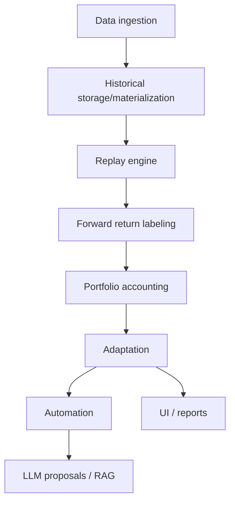
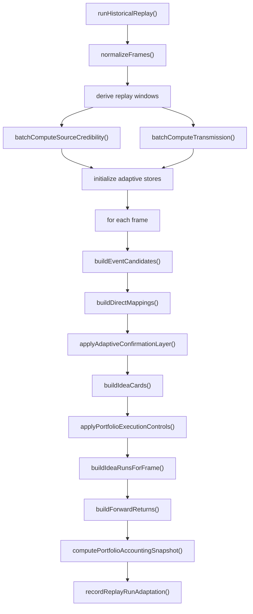

# Backtest System Deep Dive

작성일: 2026-04-01
대상 저장소: `lattice-current-fix`

## 목적

이 문서는 [BACKTEST_SYSTEM_EXPLAINER_2026-04-01.md](C:\Users\chohj\Documents\Playground\lattice-current-fix\docs\BACKTEST_SYSTEM_EXPLAINER_2026-04-01.md)의 기술 심화판이다.

대상 독자:

- 실제 구현을 읽어야 하는 개발자
- 함수 호출 순서와 책임 분리를 이해해야 하는 운영 개발자
- 룩어헤드 바이어스, 적응형 상태, 저장 구조를 점검해야 하는 리뷰어

---

## 1. 모듈 계층

계층별 핵심 파일:

- Ingestion: [historical-stream-worker.ts](C:\Users\chohj\Documents\Playground\lattice-current-fix\src\services\importer\historical-stream-worker.ts)
- Replay engine: [historical-intelligence.ts](C:\Users\chohj\Documents\Playground\lattice-current-fix\src\services\historical-intelligence.ts)
- Idea generation: [idea-generator.ts](C:\Users\chohj\Documents\Playground\lattice-current-fix\src\services\investment\idea-generator.ts)
- Portfolio: [portfolio-accounting.ts](C:\Users\chohj\Documents\Playground\lattice-current-fix\src\services\portfolio-accounting.ts)
- Adaptation: [replay-adaptation.ts](C:\Users\chohj\Documents\Playground\lattice-current-fix\src\services\replay-adaptation.ts)
- Automation: [intelligence-automation.ts](C:\Users\chohj\Documents\Playground\lattice-current-fix\src\services\server\intelligence-automation.ts)
- RAG: [ml.worker.ts](C:\Users\chohj\Documents\Playground\lattice-current-fix\src\workers\ml.worker.ts), [graph-rag.ts](C:\Users\chohj\Documents\Playground\lattice-current-fix\src\services\graph-rag.ts)

---

## 2. 핵심 타입 관점

정확한 타입 이름은 파일별로 다를 수 있지만, 구조적으로는 아래 단위를 중심으로 움직인다.

### 2.1 Historical raw item

역할:

- 외부 소스에서 수집한 가장 작은 원시 레코드

대표 속성:

- dataset id
- provider
- item kind
- valid time
- transaction time
- knowledge boundary
- payload

### 2.2 HistoricalReplayFrame

역할:

- replay의 최소 입력 단위

대표 속성:

- `timestamp`
- `transactionTime`
- `knowledgeBoundary`
- `news`
- `clusters`
- `markets`
- `warmup`

### 2.3 Event candidate

역할:

- 시장 영향 가능성이 있는 사건 가설

대표 속성:

- theme 힌트
- region
- source evidence
- strength
- event type

### 2.4 Direct mapping

역할:

- event candidate를 자산에 연결한 결과

대표 속성:

- symbol
- role
- confidence
- rationale

### 2.5 Idea card

역할:

- 사람과 엔진이 모두 읽을 수 있는 투자 아이디어 표현

대표 속성:

- theme
- region
- related symbols
- evidence summary
- meta score
- admission state

### 2.6 Idea run

역할:

- 실제 forward return 계산 대상으로 남은 평가 레코드

대표 속성:

- frame timestamp
- theme
- symbol bundle
- preferred horizon
- sizePct
- entry candidate

### 2.7 Forward return

역할:

- 한 idea run의 미래 경로 평가 결과

대표 속성:

- raw return
- signed return
- cost-adjusted return
- max drawdown
- best return
- exit reason

### 2.8 Portfolio snapshot

역할:

- idea-level 결과를 묶은 포트폴리오 성과 결과

대표 속성:

- final capital
- total return
- CAGR
- Sharpe
- max drawdown
- exposure stats

---

## 3. Replay 엔진 호출 순서

### 3.1 `runHistoricalReplay()`

역할:

- 전체 replay orchestration
- frame 흐름 제어
- 진단 결과 취합

### 3.2 `normalizeFrames()`

역할:

- timestamp 정렬
- 누락/중복 정리
- merge 가능한 frame 병합

주의점:

- 이 단계가 잘못되면 이후 모든 성과 해석이 왜곡된다

### 3.3 source/transmission batch precompute

역할:

- source 신뢰도와 event-market 전이 통계를 replay 전에 계산

주의점:

- 계산 내부가 미래 frame까지 보면 look-ahead bias 가능성이 있다

### 3.4 per-frame signal chain

역할:

- 각 frame에서 실제 판단 체인을 실행

핵심 특징:

- frame는 시간 순서로 처리된다
- warmup frame은 상태 형성에 쓰이고 평가 집계는 제한될 수 있다

---

## 4. Idea generation 세부 구조

### 4.1 `buildEventCandidates()`

입력:

- frame.news
- frame.clusters
- macro / source overlays

출력:

- 사건 후보 집합

하는 일:

- 사건 추출
- theme 힌트 부여
- source evidence 연결
- 지역/섹터 성격 추론

### 4.2 `buildDirectMappings()`

입력:

- event candidates
- symbol universe / mapping tables / learned stats

출력:

- 후보 자산 매핑

하는 일:

- 사건과 자산의 직접 연결
- primary, confirm, hedge 같은 역할 배정

### 4.3 `applyAdaptiveConfirmationLayer()`

역할:

- 초기 매핑을 재평가
- 과거 성과, regime, source quality를 반영해 조정

### 4.4 `buildIdeaCards()`

역할:

- 후보들을 theme+region 단위 카드로 묶음
- 사람이 읽을 수 있는 reasoning 구조로 만듦

### 4.5 `applyPortfolioExecutionControls()`

역할:

- 포트폴리오 예산 관점에서 과도한 아이디어를 누름

반영 요소:

- gross cap
- regime budget
- concentration control
- 현실적 execution 제약

---

## 5. Meta gate와 sizing

[idea-generator.ts](C:\Users\chohj\Documents\Playground\lattice-current-fix\src\services\investment\idea-generator.ts)의 중요한 설계는 "아이디어 생성"과 "채택"을 분리한 점이다.

핵심 수치:

- `metaHitProbability`
- `metaExpectedReturnPct`
- `metaDecisionScore`

결정 결과:

- `accepted`
- `watch`
- `rejected`

동시에 `sizePct`가 조정된다.

의미:

- 예측 아이디어는 많을 수 있다
- 하지만 실제 자본 배정은 훨씬 적게 한다

이 구조 덕분에 precision과 capital discipline을 동시에 다룰 수 있다.

---

## 6. Forward return labeling 내부 원리

### 6.1 Entry selection

핵심:

- 시그널 생성 직후 사용 가능한 다음 가격을 찾는다

목적:

- 신호 시점과 체결 시점을 분리
- 같은 바 체결 가정의 낙관성 완화

### 6.2 Path-dependent exit

핵심:

- 단순 고정 horizon만 보지 않고 경로 전체를 본다

종료 사유:

- trailing stop
- target horizon
- max hold fallback
- exit price missing

### 6.3 Metrics

계산값:

- `rawReturnPct`
- `signedReturnPct`
- `costAdjustedSignedReturnPct`
- `maxDrawdownPct`
- `bestReturnPct`
- `riskAdjustedReturn`
- `executionPenaltyPct`

### 6.4 왜 path-dependent인가

단순히 `t + 24h` 가격만 보면:

- 중간 급락
- stop-out 가능성
- execution penalty

를 놓친다.

현재 구조는 그 중 일부를 보정한다.

---

## 7. Portfolio accounting 설계

[portfolio-accounting.ts](C:\Users\chohj\Documents\Playground\lattice-current-fix\src\services\portfolio-accounting.ts)는 idea-level labels를 portfolio path로 변환한다.

구조:

1. selected adaptive horizon 결과 선택
2. symbol role별 가중 분해
3. entry/exit date 버킷 구성
4. 일별 mark-to-market
5. exposure와 cash 제약 적용
6. NAV 및 리스크 지표 산출

주의점:

- 일 단위 집계라 intraday sequencing은 단순화된다
- same-day multiple fills 현실성은 제한적이다

---

## 8. Walk-forward 구현 의미

walk-forward는 단순 분할 평가가 아니다.

흐름:

1. train 구간 replay 실행
2. 학습 상태 추출
3. validate/test 구간에 seed state 주입
4. 일반 replay와 다른 진단 분리

seed로 넘기는 것의 예:

- source profiles
- mapping stats
- bandit state
- candidate reviews

즉 walk-forward는 "과거에 학습된 편향이 다음 구간에서도 살아남는가"를 보는 장치다.

---

## 9. Adaptation 구조

[replay-adaptation.ts](C:\Users\chohj\Documents\Playground\lattice-current-fix\src\services\replay-adaptation.ts)의 역할은 replay 결과를 요약해 다음 의사결정 prior를 만든다는 점이다.

대표 갱신 항목:

- preferred horizon
- theme utility
- regime metric
- drift

위험:

- 검증 분리가 약하면 자기강화 편향이 생길 수 있다

---

## 10. 단순 평가 엔진과 메인 엔진의 차이

[evaluation-pipeline.ts](C:\Users\chohj\Documents\Playground\lattice-current-fix\src\services\evaluation\evaluation-pipeline.ts)는 메인 replay 엔진과 별도다.

용도:

- baseline 전략 간 비교
- 실험형 시그널 파이프라인 성능 점검

동작:

- frame별 signal 생성
- horizon 근처 exit 탐색
- 통계값 계산

산출:

- hit rate
- average return
- Sharpe
- Calmar
- Profit Factor
- Welch t-test

주의:

- execution realism, adaptation, idea cards 등 메인 엔진의 풍부한 구조를 모두 재현하지 않는다

---

## 11. 저장, 캐시, 아카이브 설계

### 11.1 Local analytical path

- local import
- frame materialization
- replay compute

### 11.2 Server archival path

- Postgres sync
- NAS snapshot
- backtest run archive

### 11.3 Runtime cache path

[persistent-cache.ts](C:\Users\chohj\Documents\Playground\lattice-current-fix\src\services\persistent-cache.ts)는 환경별 지속 캐시를 선택한다.

이 설계 덕분에:

- 데스크톱 앱
- 브라우저
- Node 작업

이 같은 코드 경로를 공유할 수 있다.

---

## 12. 자동화와 운영 orchestration

[intelligence-automation.ts](C:\Users\chohj\Documents\Playground\lattice-current-fix\src\services\server\intelligence-automation.ts)는 백테스트 시스템을 운영 시스템에 연결한다.

담당하는 것:

- dataset import scheduling
- replay scheduling
- walk-forward scheduling
- theme discovery queue
- candidate automation
- dataset proposal automation
- self-tuning

[backtest-nas-pipeline.mjs](C:\Users\chohj\Documents\Playground\lattice-current-fix\scripts\backtest-nas-pipeline.mjs)는 데이터 fetch와 NAS/Postgres 동기화까지 포함한 배치 운영 진입점이다.

---

## 13. Theme discovery와 Codex proposer 기술 구조

### 13.1 Theme discovery

[theme-discovery.ts](C:\Users\chohj\Documents\Playground\lattice-current-fix\src\services\theme-discovery.ts)

핵심:

- phrase overlap
- signal score
- sample/source count
- 큐 적재와 승격 후보 관리

### 13.2 Codex proposers

- [codex-theme-proposer.ts](C:\Users\chohj\Documents\Playground\lattice-current-fix\src\services\server\codex-theme-proposer.ts)
- [codex-candidate-proposer.ts](C:\Users\chohj\Documents\Playground\lattice-current-fix\src\services\server\codex-candidate-proposer.ts)
- [codex-dataset-proposer.ts](C:\Users\chohj\Documents\Playground\lattice-current-fix\src\services\server\codex-dataset-proposer.ts)

지금 구조에서는 [proposal-evidence-builder.ts](C:\Users\chohj\Documents\Playground\lattice-current-fix\src\services\server\proposal-evidence-builder.ts)가 evidence bundle을 만들어 proposer prompt에 넣는다.

즉 현재 LLM 자동화는:

- free-form 추천
- evidence-grounded 추천

중 후자 쪽으로 이동 중이다.

---

## 14. RAG 기술 구조

### 14.1 Vector RAG path

[ml.worker.ts](C:\Users\chohj\Documents\Playground\lattice-current-fix\src\workers\ml.worker.ts)에서 수행하는 일:

- embedding generation
- document ingest
- vector similarity search
- summarization
- sentiment
- NER
- semantic clustering

[vector-db.ts](C:\Users\chohj\Documents\Playground\lattice-current-fix\src\workers\vector-db.ts)는 IndexedDB에 벡터와 메타데이터를 저장한다.

### 14.2 Graph RAG path

[graph-rag.ts](C:\Users\chohj\Documents\Playground\lattice-current-fix\src\services\graph-rag.ts)는 키워드 관계 그래프를 만든다.

산출:

- 커뮤니티
- 강한 관계쌍
- 전역 테마

### 14.3 현재 백테스트와의 거리

현재는:

- briefing augmentation에는 실제 사용 중
- theme discovery 보조에 활용 여지 큼
- admission score와 직접 결합은 아직 제한적

즉 core alpha engine이라기보다 context engine 성격이 강하다.

---

## 15. 운영 UI 연결점

- [BacktestLabPanel.ts](C:\Users\chohj\Documents\Playground\lattice-current-fix\src\components\BacktestLabPanel.ts)
- [backtest-hub-window.ts](C:\Users\chohj\Documents\Playground\lattice-current-fix\src\backtest-hub-window.ts)

운영 관점 역할:

- replay run 탐색
- dataset health 파악
- 가이드와 요약 확인
- 결과 브리핑 진입

즉 이 시스템은 headless batch만 있는 것이 아니라 운영자용 시각화 표면을 갖고 있다.

---

## 16. 검토 포인트

구조를 검토할 때 우선 봐야 할 포인트:

1. source/transmission 선계산이 미래 정보를 읽지 않는가
2. adaptation state가 train/test 경계를 넘지 않는가
3. entry/exit 가격 탐색이 sparse market에서 낙관적이지 않은가
4. 포트폴리오 일 단위 집계가 실제 리스크를 과소평가하지 않는가
5. baseline evaluation 결과와 replay 결과를 잘못 비교하고 있지 않은가

---

## 17. 빠른 파일 인덱스

엔진:

- [historical-intelligence.ts](C:\Users\chohj\Documents\Playground\lattice-current-fix\src\services\historical-intelligence.ts)
- [idea-generator.ts](C:\Users\chohj\Documents\Playground\lattice-current-fix\src\services\investment\idea-generator.ts)
- [portfolio-accounting.ts](C:\Users\chohj\Documents\Playground\lattice-current-fix\src\services\portfolio-accounting.ts)
- [replay-adaptation.ts](C:\Users\chohj\Documents\Playground\lattice-current-fix\src\services\replay-adaptation.ts)

실험 평가:

- [evaluation-pipeline.ts](C:\Users\chohj\Documents\Playground\lattice-current-fix\src\services\evaluation\evaluation-pipeline.ts)

저장/적재:

- [historical-stream-worker.ts](C:\Users\chohj\Documents\Playground\lattice-current-fix\src\services\importer\historical-stream-worker.ts)
- [intelligence-postgres.ts](C:\Users\chohj\Documents\Playground\lattice-current-fix\src\services\server\intelligence-postgres.ts)
- [persistent-cache.ts](C:\Users\chohj\Documents\Playground\lattice-current-fix\src\services\persistent-cache.ts)

자동화/추천:

- [intelligence-automation.ts](C:\Users\chohj\Documents\Playground\lattice-current-fix\src\services\server\intelligence-automation.ts)
- [theme-discovery.ts](C:\Users\chohj\Documents\Playground\lattice-current-fix\src\services\theme-discovery.ts)
- [proposal-evidence-builder.ts](C:\Users\chohj\Documents\Playground\lattice-current-fix\src\services\server\proposal-evidence-builder.ts)

RAG/UI:

- [ml.worker.ts](C:\Users\chohj\Documents\Playground\lattice-current-fix\src\workers\ml.worker.ts)
- [vector-db.ts](C:\Users\chohj\Documents\Playground\lattice-current-fix\src\workers\vector-db.ts)
- [graph-rag.ts](C:\Users\chohj\Documents\Playground\lattice-current-fix\src\services\graph-rag.ts)
- [BacktestLabPanel.ts](C:\Users\chohj\Documents\Playground\lattice-current-fix\src\components\BacktestLabPanel.ts)
