# Backtest System Explainer

작성일: 2026-04-01
대상 저장소: `lattice-current-fix`

## 문서 목적

이 문서는 이 저장소의 백테스팅 구조를 처음 보는 사람도 이해할 수 있도록, 가장 기초 개념부터 운영 구조까지 한 번에 설명하는 입문서다.

이 문서가 설명하는 범위:

- 백테스트가 왜 필요한지
- 이 프로젝트의 백테스트가 일반적인 가격 규칙형 백테스트와 어떻게 다른지
- 데이터가 어디서 오고 어떻게 저장되는지
- raw 데이터가 어떻게 replay frame으로 바뀌는지
- 이벤트가 어떻게 투자 아이디어가 되는지
- 수익률과 리스크가 어떻게 계산되는지
- 포트폴리오 성과가 어떻게 집계되는지
- replay, walk-forward, adaptation이 각각 무엇인지
- 자동화, 데이터 관리, 캐시, NAS, Postgres 구조
- LLM 추천, theme discovery, RAG 구조와 실제 활용 방식
- 운영자가 어디서 무엇을 보는지

---

## 1. 한 문장 요약

이 시스템은 과거의 뉴스, 이벤트, 시장 데이터를 당시 시점 기준으로 다시 재생한 뒤, 그 시점에 만들 수 있었던 투자 아이디어를 생성하고, 이후 시장 경로를 따라 실제로 얼마나 먹혔는지 평가하는 이벤트 기반 백테스트 시스템이다.

---

## 2. 일반적인 백테스트와 무엇이 다른가

전통적인 퀀트 백테스트는 보통 아래처럼 동작한다.

- 가격 데이터가 있다
- 규칙이 있다
- 규칙이 참이면 진입한다
- 몇 시간 뒤 또는 손절/익절 시점에 청산한다

이 저장소는 그보다 넓은 문제를 푼다.

- 가격만 보지 않는다
- 뉴스, 매크로, 지정학, 소스 신뢰도, 이벤트 클러스터를 함께 본다
- 먼저 "무슨 사건이 벌어졌는가"를 해석한다
- 그 사건이 어떤 테마와 자산에 연결되는지 추론한다
- 그 결과를 투자 아이디어 카드로 만든다
- 그 아이디어를 실제로 채택할지 한 번 더 걸러낸다
- 그 다음에야 수익률을 계산한다

즉 이 구조는 `가격 규칙형 백테스터`보다 `이벤트 인텔리전스 백테스터`에 가깝다.

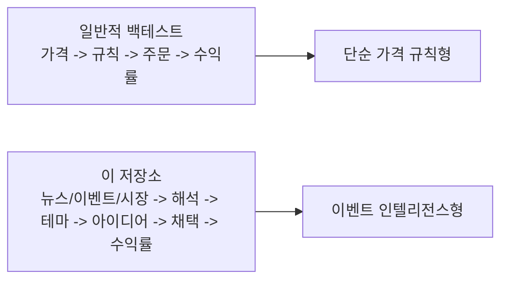

---

## 3. 전체 시스템 큰 그림

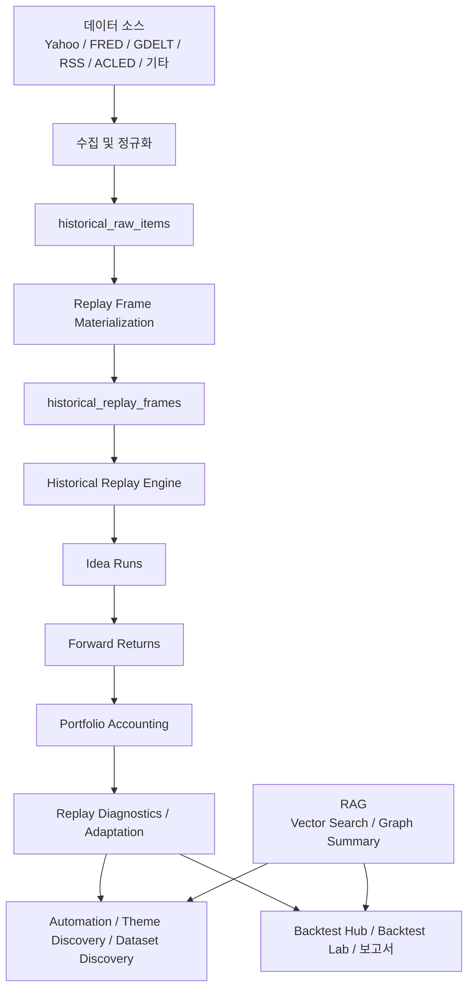

이 구조를 이해할 때 핵심은 세 가지다.

1. 데이터 수집과 백테스트 엔진이 분리되어 있다.
2. 아이디어 생성과 수익률 계산이 분리되어 있다.
3. 백테스트 결과가 다음 자동화와 추천 루프에 다시 들어간다.

---

## 4. 가장 중요한 개념: Frame

이 프로젝트에서 가장 중요한 단위는 `HistoricalReplayFrame`이다.

frame은 단순히 "한 시점의 가격"이 아니라, 어떤 시점까지 알 수 있었던 정보를 묶어놓은 패킷이다.

frame 안에는 보통 이런 것들이 있다.

- 뉴스
- 이벤트 클러스터
- 시장 가격 시계열 일부
- 타임스탬프 경계 정보
- warmup 여부

쉽게 말하면:

- "2025-03-10 06:00 시점에 실제로 알고 있었을 법한 정보 꾸러미"

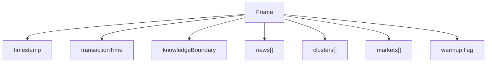

---

## 5. 왜 시간 개념이 세 개나 필요한가

이 시스템은 미래 정보 누수를 막기 위해 시간 개념을 나눠 쓴다.

### 5.1 validTime

- 사건이나 데이터가 실제로 의미를 가지는 시간
- 예: 실업률이 2025-02-01 데이터를 설명한다면 그 날짜가 valid time

### 5.2 transactionTime

- 시스템이 그 정보를 실제로 받아들인 시간
- 예: 2월 데이터가 3월 초에 수집되었다면 transaction time은 3월

### 5.3 knowledgeBoundary

- 해당 frame에서 볼 수 있는 정보의 상한선
- 이 경계를 넘어선 데이터는 봐서는 안 된다

이 세 개를 쓰는 이유는 간단하다.

- 과거를 다시 재생할 때 미래 데이터를 몰래 보지 않기 위해서다

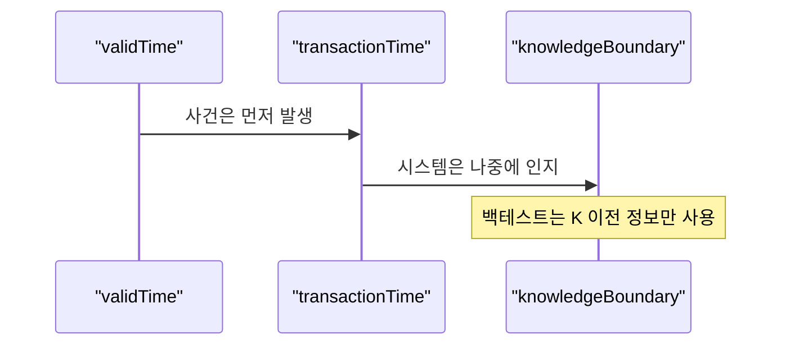

---

## 6. 어떤 데이터를 쓰는가

이 프로젝트는 단일 데이터 소스가 아니라 여러 종류의 데이터를 함께 쓴다.

### 6.1 역사 백테스트용 핵심 소스

시장 데이터:

- `yahoo-chart`
- `coingecko`

매크로 데이터:

- `fred`
- `alfred`

뉴스/이벤트 데이터:

- `gdelt-doc`
- `rss-feed`
- `acled`

이 소스들은 주로 [historical-stream-worker.ts](C:\Users\chohj\Documents\Playground\lattice-current-fix\src\services\importer\historical-stream-worker.ts)와 [intelligence-automation.ts](C:\Users\chohj\Documents\Playground\lattice-current-fix\src\services\server\intelligence-automation.ts)에서 역사 데이터셋 단위로 다뤄진다.

### 6.2 실시간 인텔리전스 전체 플랫폼 소스

백테스트는 더 큰 인텔리전스 플랫폼의 일부다. [data-loader.ts](C:\Users\chohj\Documents\Playground\lattice-current-fix\src\app\data-loader.ts) 기준으로 연결 범위는 훨씬 넓다.

- RSS / 일반 뉴스 피드
- 주식 / ETF / 암호자산 시세
- FRED 매크로
- 날씨 / 지진 / 재난
- AIS 선박 데이터
- 군사 / 분쟁 신호
- 무역 / 공급망 관련 신호
- 사이버 보안 신호
- arXiv
- GitHub
- Hacker News

즉 백테스트는 독립 도구라기보다 전체 데이터 운영망 위에 올라간 분석 엔진이다.

---

## 7. 데이터는 어디에 저장되는가

### 7.1 역사 데이터 저장 계층

역사 데이터 저장과 materialization의 중심은 [historical-stream-worker.ts](C:\Users\chohj\Documents\Playground\lattice-current-fix\src\services\importer\historical-stream-worker.ts)다.

주요 테이블은 다음과 같다.

#### `historical_raw_items`

아직 frame으로 묶기 전의 원시 레코드다.

예:

- 뉴스 기사 1건
- 시장 가격 포인트 1건
- 매크로 관측치 1건

대표 필드:

- `dataset_id`
- `provider`
- `item_kind`
- `valid_time_start`
- `transaction_time`
- `knowledge_boundary`
- `headline`
- `symbol`
- `price`
- `payload`

#### `historical_replay_frames`

원시 레코드를 시간 버킷으로 묶어 만든 replay 입력 단위다.

대표 필드:

- `dataset_id`
- `bucket_hours`
- `bucket_start`
- `bucket_end`
- `transaction_time`
- `knowledge_boundary`
- `warmup`
- `news_count`
- `cluster_count`
- `market_count`
- `payload_json`

#### `historical_datasets`

데이터셋 자체의 요약 정보다.

- raw item 수
- frame 수
- 버킷 크기
- warmup frame 수
- 시간 범위
- 품질 메타데이터

### 7.2 Postgres 저장 및 동기화 역할

[intelligence-postgres.ts](C:\Users\chohj\Documents\Playground\lattice-current-fix\src\services\server\intelligence-postgres.ts)는 서버 측 장기 보관과 조회용 스토리지를 담당한다.

여기에는 아래 구조가 포함된다.

- `historical_raw_items`
- `historical_replay_frames`
- `historical_datasets`
- `backtest_runs`
- lifecycle log 성격의 보조 기록

로컬에서 생성한 결과를 NAS나 Postgres 쪽으로 동기화해 장기 아카이브와 운영 조회를 가능하게 하는 구조다.

### 7.3 캐시와 로컬 지속성

[persistent-cache.ts](C:\Users\chohj\Documents\Playground\lattice-current-fix\src\services\persistent-cache.ts)는 실행 환경별 캐시 저장 위치를 추상화한다.

- Tauri 데스크톱 환경이면 앱 데이터 경로 사용
- 브라우저 환경이면 IndexedDB 사용
- Node 환경이면 `data/persistent-cache` 사용
- 마지막 fallback으로 localStorage 사용

즉 이 프로젝트는 단순 메모리 캐시가 아니라 환경별 지속 저장 계층을 이미 갖고 있다.

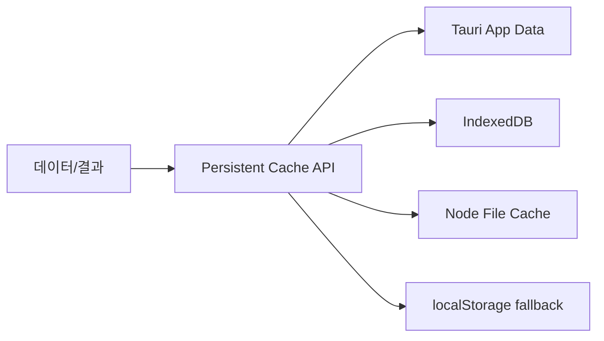

---

## 8. raw 데이터가 frame으로 바뀌는 과정

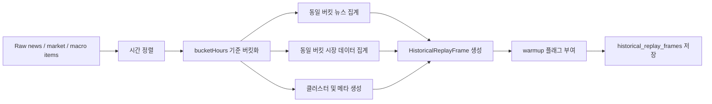

### 8.1 bucketHours

`bucketHours`는 몇 시간 단위로 frame을 만들지 정하는 값이다.

예:

- `bucketHours = 6`
- 하루가 4개 frame으로 쪼개진다

이 값이 작을수록:

- 더 세밀한 반응 가능
- noise 증가 가능
- 계산량 증가

이 값이 클수록:

- 더 안정적 요약
- 반응 속도 저하
- 세부 경로 손실

### 8.2 warmup

초기 frame은 평가보다 학습/준비 구간으로 쓰일 수 있다.

이 구간에서는:

- source 신뢰도
- 적응형 파라미터
- 매핑 통계

같은 상태를 예열한다.

즉 warmup은 성과 집계를 위한 구간이 아니라 시스템을 "준비시키는 구간"이다.

---

## 9. 메인 백테스트 엔진은 어떻게 동작하는가

메인 엔진은 [historical-intelligence.ts](C:\Users\chohj\Documents\Playground\lattice-current-fix\src\services\historical-intelligence.ts)에 있다.

큰 흐름은 아래와 같다.

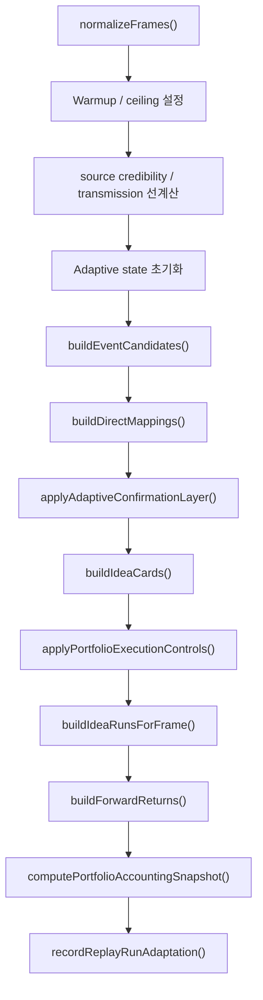

이 순서를 한 줄씩 풀어보면 아래와 같다.

### 9.1 `normalizeFrames()`

- frame 정렬
- 시간 보정
- 같은 시점 frame 병합

### 9.2 warmup / ceiling 적용

- 어떤 frame은 학습만 하고 평가하지 않음
- 어떤 시점 이후 데이터는 보지 않음

### 9.3 source credibility / transmission 선계산

- 어떤 소스가 얼마나 신뢰할 만한지
- 어떤 이벤트가 어떤 시장에 전이되는지

를 미리 계산해둔다.

### 9.4 adaptive state 초기화

- theme별 적응형 파라미터
- macro overlay
- review state

등을 준비한다.

### 9.5 이벤트 후보 생성

- 뉴스와 클러스터에서 투자 의미가 있어 보이는 사건을 뽑는다

### 9.6 자산 직접 매핑

- 해당 사건이 어떤 종목/ETF/자산에 연결되는지 계산한다

### 9.7 적응형 확인 레이어

- 단순 매핑 결과를 바로 쓰지 않고 추가 확인을 한다

### 9.8 아이디어 카드 생성

- 비슷한 theme와 region 단위로 묶어 사람과 엔진이 해석 가능한 카드로 만든다

### 9.9 포트폴리오 실행 제약 적용

- 리스크 예산
- 동시 노출
- regime budget

등을 반영해 현실성 없는 아이디어를 누른다.

### 9.10 idea run 생성

- 실제 평가 대상으로 남을 아이디어 레코드를 만든다

### 9.11 forward return 계산

- 진입 이후 시장 경로를 따라 수익률과 drawdown을 계산한다

### 9.12 포트폴리오 회계

- 개별 idea 수준 결과를 하나의 NAV 경로로 집계한다

### 9.13 adaptation 기록

- 어떤 테마와 horizon이 잘 먹혔는지 다음 replay를 위해 저장한다

---

## 10. 이벤트가 어떻게 투자 아이디어가 되는가

핵심 생성 로직은 [idea-generator.ts](C:\Users\chohj\Documents\Playground\lattice-current-fix\src\services\investment\idea-generator.ts)에 있다.

### 10.1 이벤트 후보

뉴스나 클러스터로부터 다음을 추출한다.

- 사건 유형
- 관련 지역
- 관련 키워드
- 소스 강도
- 시장 반응 가능성

### 10.2 직접 매핑

이 후보를 자산 후보에 연결한다.

예:

- 반도체 공급망 차질 -> 반도체 ETF / 관련 종목
- 지정학 리스크 -> 방산 / 에너지 / 안전자산

### 10.3 아이디어 카드

비슷한 후보를 묶어서 하나의 카드로 만든다.

카드는 보통 이런 질문에 답한다.

- 무슨 테마인가
- 어떤 지역/섹터인가
- 어떤 자산이 대표적인가
- 왜 지금 의미가 있는가

### 10.4 메타 게이트

카드가 만들어졌다고 바로 채택되지는 않는다.

주요 계산값:

- `metaHitProbability`
- `metaExpectedReturnPct`
- `metaDecisionScore`

이 값으로 admission state를 정한다.

- `accepted`
- `watch`
- `rejected`

즉 "시그널이 있다"와 "자본을 배정한다"는 다르다.

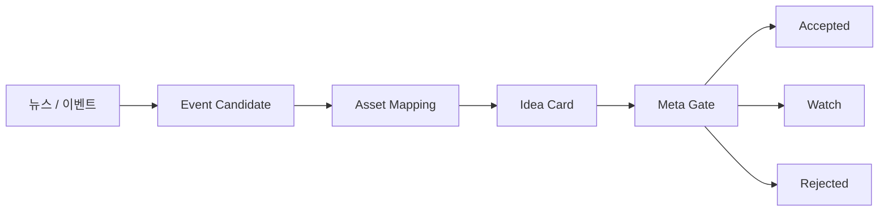

---

## 11. 무엇과 무엇을 비교하는가

이 질문은 중요하다. 이 시스템은 여러 수준의 비교를 동시에 한다.

### 11.1 동일 frame 내 비교

- 어떤 이벤트가 다른 이벤트보다 강한가
- 어떤 자산 매핑이 더 설득력 있는가

### 11.2 동일 테마 내 비교

- 현재 아이디어가 과거 같은 테마 아이디어보다 좋은가
- 어떤 horizon이 더 유리한가

### 11.3 실제 시장 경로와의 비교

- 아이디어가 생성된 뒤 실제 시장이 어떻게 움직였는가
- trailing stop에 걸렸는가
- 목표 horizon까지 버텼는가

### 11.4 포트폴리오 수준 비교

- 개별 idea 성과와 포트폴리오 성과가 같은 방향인가
- 좋은 아이디어가 많아도 포트폴리오가 망가질 수 있는가

즉 이 시스템은 "예측이 맞았는가"만 보지 않고, "실제 포트폴리오 성과로 이어졌는가"도 따로 본다.

---

## 12. 수익률은 어떻게 계산되는가

수익률 계산 핵심은 [historical-intelligence.ts](C:\Users\chohj\Documents\Playground\lattice-current-fix\src\services\historical-intelligence.ts)의 `buildForwardReturns()`다.

### 12.1 진입가

보통 아이디어 생성 직후의 가장 가까운 다음 시장 바를 사용한다.

의도:

- 시그널이 발생한 같은 순간 가격을 쓰지 않기
- 조금 더 현실적인 진입 가정 사용

### 12.2 보유 경로 추적

그 다음 미래 가격 경로를 따라간다.

중간에 보는 것:

- 최고 수익률
- 최대 낙폭
- trailing stop 충족 여부
- target horizon 도달 여부
- max hold 초과 여부

### 12.3 청산 규칙

단순히 "24시간 뒤 청산"만 쓰지 않는다.

가능한 종료 사유:

- `trailing-stop`
- `target-horizon`
- `max-hold-fallback`
- `no-exit-price`

### 12.4 저장되는 성과 지표

- `rawReturnPct`
- `signedReturnPct`
- `costAdjustedSignedReturnPct`
- `maxDrawdownPct`
- `bestReturnPct`
- `riskAdjustedReturn`
- `executionPenaltyPct`

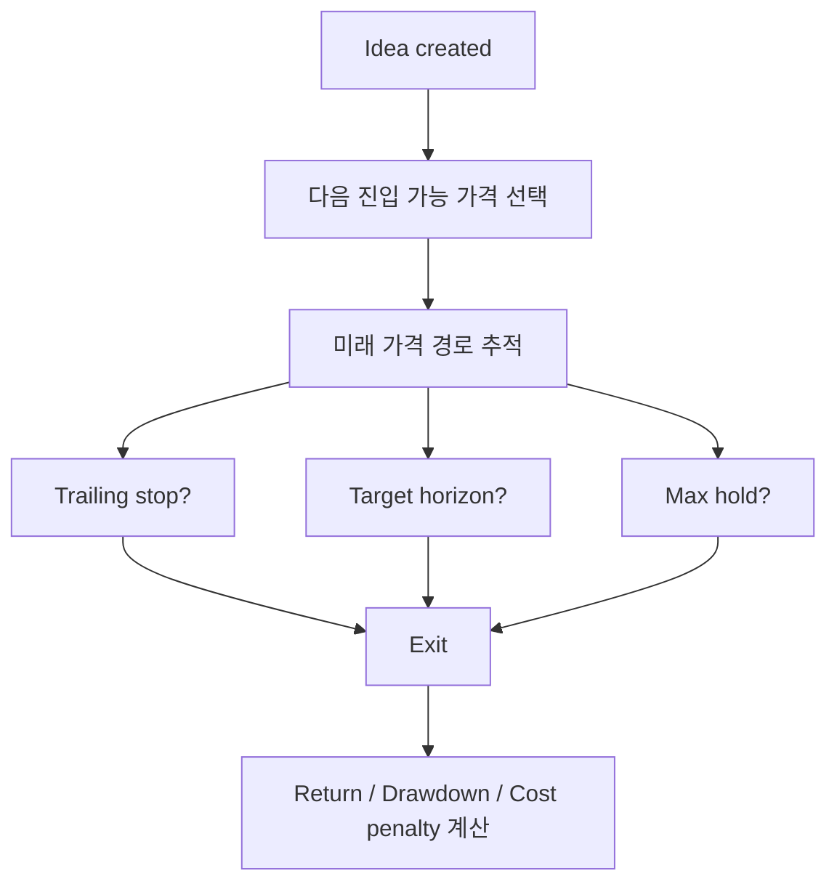

---

## 13. execution penalty는 왜 필요한가

raw return만 보면 실제 체결 가능성을 과대평가하기 쉽다.

그래서 시스템은 `assessExecutionReality()` 같은 레이어를 통해 다음 요소를 반영한다.

- 유동성
- 세션 상태
- 최근 변동성
- 체결 현실성

결과적으로:

- raw return은 좋아 보여도
- cost-adjusted return은 나빠질 수 있다

즉 단순 종가 비교보다 현실적인 쪽으로 한 단계 더 들어간 계산이다.

---

## 14. 포트폴리오 성과는 어떻게 계산되는가

개별 idea 결과만으로는 충분하지 않다. 실제 포트폴리오 관점으로 다시 집계해야 한다.

이 역할은 [portfolio-accounting.ts](C:\Users\chohj\Documents\Playground\lattice-current-fix\src\services\portfolio-accounting.ts)가 맡는다.

### 14.1 대표 horizon 선택

idea마다 여러 horizon 후보가 있을 수 있는데, 그중 적응형으로 선택된 대표 결과를 쓴다.

### 14.2 포지션 가중치 분배

idea의 `sizePct`를 symbol role에 따라 나눈다.

예:

- `primary`
- `confirm`
- `hedge`

### 14.3 일별 NAV 집계

- entry date와 exit date 기준으로 포지션 일정 구성
- gross exposure 100% cap 적용
- 현금과 오픈 포지션을 함께 마크투마켓

### 14.4 최종 산출

- `finalCapital`
- `totalReturnPct`
- `CAGR`
- `maxDrawdownPct`
- `Sharpe`
- 평균 cash 비중
- 평균 gross/net exposure

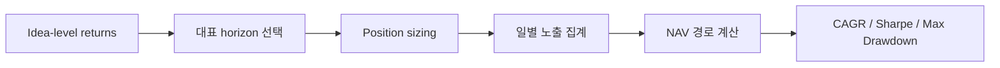

---

## 15. replay, walk-forward, adaptation은 무엇이 다른가

### 15.1 replay

과거 전체 구간을 시점 순서대로 다시 재생한다.

목적:

- 시스템이 과거에 어떤 판단을 했을지 재현

### 15.2 walk-forward

구간을 나눈다.

- train
- validate
- test

train에서 얻은 상태를 들고 다음 구간에 적용한다.

목적:

- 과거 학습 결과가 미래 구간에서도 유지되는지 확인

### 15.3 adaptation

여러 replay 결과를 바탕으로:

- theme별 선호 horizon
- utility
- regime metric
- drift

등을 갱신한다.

목적:

- 다음 replay나 자동화에 더 나은 prior 제공

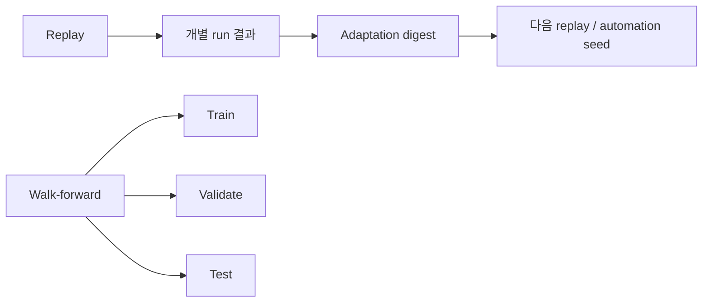

---

## 16. 이 저장소에는 백테스트 엔진이 하나만 있는가

아니다. 적어도 두 층이 있다.

### 16.1 메인 엔진

[historical-intelligence.ts](C:\Users\chohj\Documents\Playground\lattice-current-fix\src\services\historical-intelligence.ts)

특징:

- 이벤트/뉴스 기반
- 아이디어 생성형
- 적응형 horizon
- execution penalty
- 포트폴리오 회계
- adaptation 연결

### 16.2 단순 평가 엔진

[evaluation-pipeline.ts](C:\Users\chohj\Documents\Playground\lattice-current-fix\src\services\evaluation\evaluation-pipeline.ts)

특징:

- baseline 전략 비교용
- signal 생성 후 horizon 근처 exit 찾기
- 통계 지표 계산

주요 산출:

- hit rate
- average return
- Sharpe
- Calmar
- Profit Factor
- Welch t-test

즉 메인 엔진은 운영형 replay 엔진이고, evaluation pipeline은 실험형 baseline 비교 엔진에 가깝다.

---

## 17. 운영자는 어디서 이것을 보는가

백엔드 엔진만 있는 것이 아니라, 운영자가 보는 UI 레이어도 있다.

### 17.1 Backtest Lab

[BacktestLabPanel.ts](C:\Users\chohj\Documents\Playground\lattice-current-fix\src\components\BacktestLabPanel.ts)

역할:

- replay 결과 탐색
- guidance 확인
- dataset health 확인
- 실험 결과 해석 보조

### 17.2 Backtest Hub Window

[backtest-hub-window.ts](C:\Users\chohj\Documents\Playground\lattice-current-fix\src\backtest-hub-window.ts)

역할:

- 백테스트 관련 운영 화면 진입점
- 실행 이력, 결과 브리핑, 관리 도구 연결

즉 운영자는 코드 파일을 직접 보지 않아도, UI 계층에서 run 상태와 결과를 확인할 수 있다.

---

## 18. 자동화는 어떻게 돌아가는가

자동화 중심은 [intelligence-automation.ts](C:\Users\chohj\Documents\Playground\lattice-current-fix\src\services\server\intelligence-automation.ts)다.

자동 수행 가능한 작업 예:

- 데이터셋 fetch/import
- historical replay
- walk-forward backtest
- theme discovery queue 생성
- candidate expansion
- dataset proposal
- self-tuning cycle
- source automation
- snapshot push

운영 파이프라인 관점 진입점은 [backtest-nas-pipeline.mjs](C:\Users\chohj\Documents\Playground\lattice-current-fix\scripts\backtest-nas-pipeline.mjs)다.

여기서는:

- Yahoo/FRED/GDELT 데이터 수집
- DuckDB 적재
- replay run 캐시 동기화
- NAS / Postgres 스냅샷 전송

까지 이어진다.

---

## 19. theme discovery와 LLM 추천은 어디에 붙는가

### 19.1 theme discovery

[theme-discovery.ts](C:\Users\chohj\Documents\Playground\lattice-current-fix\src\services\theme-discovery.ts)는 반복되는 motif를 찾아 새 테마 후보를 만든다.

주요 기준:

- phrase overlap
- signal score
- sample 수
- source 수

### 19.2 LLM / Codex 추천

관련 파일:

- [codex-theme-proposer.ts](C:\Users\chohj\Documents\Playground\lattice-current-fix\src\services\server\codex-theme-proposer.ts)
- [codex-candidate-proposer.ts](C:\Users\chohj\Documents\Playground\lattice-current-fix\src\services\server\codex-candidate-proposer.ts)
- [codex-dataset-proposer.ts](C:\Users\chohj\Documents\Playground\lattice-current-fix\src\services\server\codex-dataset-proposer.ts)
- [proposal-evidence-builder.ts](C:\Users\chohj\Documents\Playground\lattice-current-fix\src\services\server\proposal-evidence-builder.ts)

이 레이어는:

- 새 theme 제안
- 자산 후보 확장
- dataset 제안

을 자동화 루프 안에 넣는다.

즉 LLM은 독립 챗봇이 아니라 자동화 사이클의 추천 엔진 일부다.

---

## 20. RAG는 현재 어떻게 구현되어 있는가

이 프로젝트의 RAG는 하나가 아니라 두 갈래다.

### 20.1 Vector RAG

핵심 파일:

- [ml-worker.ts](C:\Users\chohj\Documents\Playground\lattice-current-fix\src\services\ml-worker.ts)
- [ml.worker.ts](C:\Users\chohj\Documents\Playground\lattice-current-fix\src\workers\ml.worker.ts)
- [vector-db.ts](C:\Users\chohj\Documents\Playground\lattice-current-fix\src\workers\vector-db.ts)

기능:

- 임베딩 생성
- 문서/헤드라인 벡터 저장
- 유사도 검색
- 요약
- 감성 분석
- 개체명 인식
- semantic clustering

`vector-db.ts`는 IndexedDB 기반으로 텍스트, 임베딩, 날짜, 소스, URL, 태그 등을 저장한다.

### 20.2 Graph RAG

핵심 파일:

- [graph-rag.ts](C:\Users\chohj\Documents\Playground\lattice-current-fix\src\services\graph-rag.ts)

기능:

- 키워드 관계 그래프 생성
- connected component 계산
- community 탐지
- 강한 연관 키워드 찾기
- 글로벌 테마 요약

### 20.3 현재 실제 사용처

예:

- [country-intel.ts](C:\Users\chohj\Documents\Playground\lattice-current-fix\src\app\country-intel.ts)

현재 headline을 바탕으로 vector search를 하고, 과거 유사 snippet을 가져와 브리핑 맥락에 넣는다.

또한 [data-loader.ts](C:\Users\chohj\Documents\Playground\lattice-current-fix\src\app\data-loader.ts) 레벨에서 graph summary 계열 함수들이 broader intelligence layer에 연결된다.

즉 현재 RAG는:

- 브리핑 보강
- 과거 유사 사례 탐색
- 구조 요약

에는 이미 쓰이고 있다.

다만 아직 백테스트 핵심 admission 계산과 깊게 결합된 단계는 아니다.

---

## 21. 데이터 관리와 자동화 운영을 한 그림으로 보면

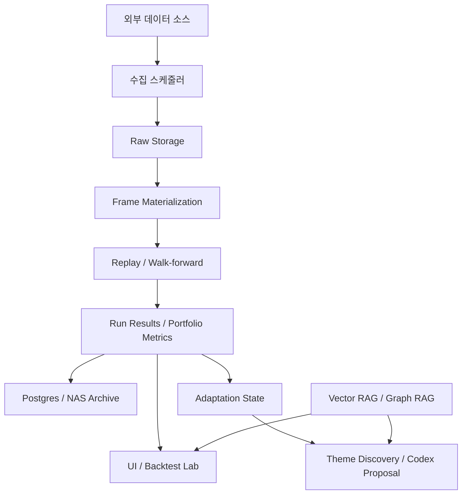

---

## 22. 이 구조의 강점은 무엇인가

- 가격만 보는 시스템보다 넓은 맥락을 반영한다
- 미래 정보 누수를 막기 위한 시간 경계가 강하다
- 개별 아이디어와 포트폴리오 성과를 분리해 평가한다
- replay 결과가 다음 적응형 상태로 이어진다
- 자동화, 추천, RAG가 같은 운영망 안에 들어와 있다

---

## 23. 현재 한계는 무엇인가

- heuristic 숫자 의존이 아직 많다
- 일부 선계산이 look-ahead 위험을 가질 수 있어 점검이 필요하다
- 포트폴리오 회계가 일 단위 중심이라 intraday 경로 단순화가 있다
- RAG는 존재하지만 백테스트 코어 의사결정까지는 완전히 연결되지 않았다
- baseline evaluation과 메인 replay 엔진은 성격이 다르므로 결과를 직접 비교하면 해석이 어긋날 수 있다

---

## 24. 관련 파일 지도

백테스트 코어:

- [historical-intelligence.ts](C:\Users\chohj\Documents\Playground\lattice-current-fix\src\services\historical-intelligence.ts)
- [portfolio-accounting.ts](C:\Users\chohj\Documents\Playground\lattice-current-fix\src\services\portfolio-accounting.ts)
- [idea-generator.ts](C:\Users\chohj\Documents\Playground\lattice-current-fix\src\services\investment\idea-generator.ts)
- [replay-adaptation.ts](C:\Users\chohj\Documents\Playground\lattice-current-fix\src\services\replay-adaptation.ts)

실험용 평가 엔진:

- [evaluation-pipeline.ts](C:\Users\chohj\Documents\Playground\lattice-current-fix\src\services\evaluation\evaluation-pipeline.ts)

데이터 적재 / materialization:

- [historical-stream-worker.ts](C:\Users\chohj\Documents\Playground\lattice-current-fix\src\services\importer\historical-stream-worker.ts)
- [intelligence-postgres.ts](C:\Users\chohj\Documents\Playground\lattice-current-fix\src\services\server\intelligence-postgres.ts)
- [persistent-cache.ts](C:\Users\chohj\Documents\Playground\lattice-current-fix\src\services\persistent-cache.ts)

자동화:

- [intelligence-automation.ts](C:\Users\chohj\Documents\Playground\lattice-current-fix\src\services\server\intelligence-automation.ts)
- [backtest-nas-pipeline.mjs](C:\Users\chohj\Documents\Playground\lattice-current-fix\scripts\backtest-nas-pipeline.mjs)

테마/LLM 추천:

- [theme-discovery.ts](C:\Users\chohj\Documents\Playground\lattice-current-fix\src\services\theme-discovery.ts)
- [codex-theme-proposer.ts](C:\Users\chohj\Documents\Playground\lattice-current-fix\src\services\server\codex-theme-proposer.ts)
- [codex-candidate-proposer.ts](C:\Users\chohj\Documents\Playground\lattice-current-fix\src\services\server\codex-candidate-proposer.ts)
- [codex-dataset-proposer.ts](C:\Users\chohj\Documents\Playground\lattice-current-fix\src\services\server\codex-dataset-proposer.ts)
- [proposal-evidence-builder.ts](C:\Users\chohj\Documents\Playground\lattice-current-fix\src\services\server\proposal-evidence-builder.ts)

RAG:

- [ml-worker.ts](C:\Users\chohj\Documents\Playground\lattice-current-fix\src\services\ml-worker.ts)
- [ml.worker.ts](C:\Users\chohj\Documents\Playground\lattice-current-fix\src\workers\ml.worker.ts)
- [vector-db.ts](C:\Users\chohj\Documents\Playground\lattice-current-fix\src\workers\vector-db.ts)
- [graph-rag.ts](C:\Users\chohj\Documents\Playground\lattice-current-fix\src\services\graph-rag.ts)

운영 UI:

- [BacktestLabPanel.ts](C:\Users\chohj\Documents\Playground\lattice-current-fix\src\components\BacktestLabPanel.ts)
- [backtest-hub-window.ts](C:\Users\chohj\Documents\Playground\lattice-current-fix\src\backtest-hub-window.ts)

---

## 25. 다음에 읽으면 좋은 문서

- 기술 심화판: `BACKTEST_SYSTEM_DEEP_DIVE_2026-04-01.md`
- 운영자용 1페이지 요약: `BACKTEST_OPERATOR_QUICKSTART_2026-04-01.md`
