# Connected System Workflow Visual

이 문서는 `lattice-current-fix`의 전체 운영 흐름을 `수집 -> 저장 -> 계산 -> 서빙 -> UI 클릭 -> 인간 승인/자동화 -> 다시 시스템 반영`까지 한 화면으로 묶어 보여준다.

읽는 법:
- 왼쪽에서 오른쪽으로 갈수록 `입력 -> 처리 -> 출력`이다.
- 파란/중앙 계층은 시스템 내부 데이터 흐름이다.
- 오른쪽 위는 대시보드와 OpenClaw의 사용자 동선이다.
- 점선이 아니라 일반 화살표로 모두 연결했고, 각 연결에는 가능한 범위에서 기능 설명을 붙였다.
- `① ② ③ ④ ⑤`는 대표 클릭 시퀀스다.

```mermaid
flowchart LR
  subgraph EXT["External Inputs"]
    RSS["RSS / News / OSINT feeds"]
    DATA["FRED / Yahoo / Market quotes"]
    HIST["Historical warm store / NAS backfill / replay artifacts"]
    OPREQ["Operator question / approval / remediation intent"]
  end

  subgraph ING["Ingestion And Intake"]
    FEEDS["Feed collectors / article fetchers"]
    FRED["refresh-fred-signals-to-nas.mjs"]
    MKT["refresh-market-quotes-to-nas.mjs"]
    HEAL["self-heal-sources / proposal ingestion"]
    SIDE["local sidecar / desktop hooks"]
  end

  subgraph STORE["Normalization And Storage"]
    ART["articles"]
    CANON["canonical event resolution"]
    HYGIENE["source hygiene\nwire_source / publisher_group / HHI"]
    FREDOBS["fred_observations"]
    MKTQ["market_quotes"]
    SIG["signal_history\nobserved / proxy / composite / imputed"]
    QUEUE["approval_queue / discovery_triage / proposal state"]
    EST["estimated_signal_nowcasts"]
    RECON["nowcast_reconciliation"]
    REG["model_registry / training snapshots"]
    NAS["NAS Postgres / cache / manifests"]
  end

  subgraph COMP["Compute And Derivation"]
    TRANS["event-market transmission"]
    SNAP["theme briefs / structural alerts / KPI snapshots"]
    COMPNOW["compute-composite-nowcasts.mjs\nmarketStress nowcast"]
    EINT["compute-event-intensity-nowcast.mjs"]
    RATES["compute-rates-nowcast.mjs\nopt-in only"]
    REC["reconcile-nowcasts.mjs"]
    TRAIN["train-*.py / validate / acceptance gate"]
    REPLAY["historical replay / backtest / validation"]
    GATE["source gate / coverage audit / abstain logic"]
  end

  subgraph ORCH["Orchestration"]
    DAEMON["master-daemon"]
    SCHED["automation cycle / scheduler"]
    OCGW["OpenClaw Gateway\nplugin + tools + webhooks + agents"]
  end

  subgraph API["Serving Layer"]
    EDAPI["event-dashboard-api.mjs"]
    TOOLS["OpenClaw lattice tools"]
  end

  subgraph UI["User Surfaces And Click Sequences"]
    HOME["Home surface\nActionable Signals / theme digest / KPI strip"]
    INBOX["Decision Inbox\nproposal / approval / triage unified queue"]
    INVEST["Investigate\nTheme Brief / evidence / citations"]
    GEO["Geo Lens\nmap iframe / spatial context"]
    OPS["Ops\nruntime / freshness / source ops / health"]
    OCHAT["OpenClaw chat / control UI"]

    C1["① Click: Home -> Open Decision Inbox"]
    C2["② Click: Inbox item -> Preview -> Simulate / Accept / Reject"]
    C3["③ Click: theme chip / Open full brief"]
    C4["④ Click: Geo Lens / Ops nav"]
    C5["⑤ Click: Ask OpenClaw for brief / health / queue state"]
  end

  subgraph HUMAN["Human Review And Feedback"]
    HREV["Human review\naccept / reject / canonical / watch / suppress"]
    HEXEC["proposal execution / source repair / review writeback"]
    HBRIEF["briefing / retry / incident follow-up"]
  end

  RSS -->|"fetch raw articles"| FEEDS
  DATA -->|"pull observed macro / market series"| FRED
  DATA -->|"pull quote snapshots"| MKT
  HIST -->|"bootstrap history / replay corpus / warm coverage"| REPLAY
  OPREQ -->|"manual request / ask / approve"| OCGW

  FEEDS -->|"insert article rows"| ART
  FRED -->|"write observed macro history"| FREDOBS
  FRED -->|"tag observed/proxy signal rows"| SIG
  MKT -->|"write market quote snapshots"| MKTQ
  MKT -->|"write selected market signals"| SIG
  HEAL -->|"create or update review items"| QUEUE
  SIDE -->|"local control-plane hooks / runtime metadata"| NAS

  ART -->|"cluster / normalize related stories"| CANON
  ART -->|"classify publisher / wire / concentration"| HYGIENE
  FREDOBS -->|"feed latest observed series"| SIG
  MKTQ -->|"feature source for nowcast / market views"| COMPNOW
  MKTQ -->|"feature source for opt-in rates nowcast"| RATES
  SIG -->|"latest observed values for snapshots"| SNAP
  SIG -->|"inputs for composite / event / rates compute"| COMPNOW
  SIG -->|"inputs for event intensity compute"| EINT
  SIG -->|"observed target series for training / reconcile"| TRAIN
  QUEUE -->|"pending review state exposed to UI"| EDAPI

  CANON -->|"derive canonical events / pathways"| TRANS
  HYGIENE -->|"wire collapse / relevance filters"| EINT
  TRANS -->|"write derived transmission signals"| SIG
  REPLAY -->|"build train windows / replay validation"| TRAIN
  REPLAY -->|"generate historical evaluation artifacts"| SNAP
  GATE -->|"allow / abstain / block bad coverage"| RATES
  GATE -->|"gate feature eligibility / source drift"| TRAIN

  TRAIN -->|"register validated model metadata"| REG
  TRAIN -->|"save model only if gate passes"| REG
  COMPNOW -->|"write nowcast rows"| EST
  EINT -->|"write event intensity estimate rows"| EST
  RATES -->|"write rate estimate rows only when enabled + model exists"| EST
  REC -->|"compare estimate vs later observation"| RECON
  REC -->|"update last_observed_at / error stats"| EST
  REG -->|"promotion_state / model lookup"| EDAPI
  EST -->|"estimated values + confidence + intervals"| EDAPI
  RECON -->|"calibration / drift evidence"| EDAPI
  ART -->|"source articles / evidence pool"| NAS
  CANON -->|"canonical event state"| NAS
  HYGIENE -->|"source metadata / HHI state"| NAS
  FREDOBS -->|"observed macro history"| NAS
  MKTQ -->|"quote history / coverage"| NAS
  SIG -->|"core signal history"| NAS
  QUEUE -->|"approval / triage state"| NAS
  EST -->|"estimated nowcast rows"| NAS
  RECON -->|"reconciliation stats"| NAS
  REG -->|"model registry / training snapshots"| NAS

  SCHED -->|"kick recurring automation cycle"| DAEMON
  DAEMON -->|"run quote refresh / compute / reconcile tasks"| MKT
  DAEMON -->|"run composite nowcast task"| COMPNOW
  DAEMON -->|"run event intensity nowcast task"| EINT
  DAEMON -->|"run rates nowcast only if NOWCAST_RATES_ENABLED=true"| RATES
  DAEMON -->|"run reconciliation task"| REC
  DAEMON -->|"emit events / summaries for operators"| OCGW

  NAS -->|"read assembled state"| EDAPI
  SNAP -->|"serve curated theme brief / KPI snapshot"| EDAPI
  EDAPI -->|"JSON APIs: kpi-summary / live-status / theme-brief / approval-queue / discovery-triage"| HOME
  EDAPI -->|"queue payload + action endpoints"| INBOX
  EDAPI -->|"theme brief + notebook + citations"| INVEST
  EDAPI -->|"ops health / freshness / source ops snapshot"| OPS
  TOOLS -->|"same read/write surface exposed as tools"| OCHAT
  OCGW -->|"tool invocation / briefing / webhook-triggered flows"| TOOLS
  EDAPI -->|"OpenClaw tool backend"| TOOLS

  HOME -->|"surface switch"| C1
  C1 -->|"switchSurface('inbox') + load queue"| INBOX

  HOME -->|"theme chip / structural alert / digest item"| C3
  INVEST -->|"already-open detailed brief surface"| C3
  C3 -->|"openThemeBrief(theme) -> /api/theme-brief/:theme"| EDAPI
  C3 -->|"load detailed narrative / citations / watchpoints"| INVEST

  INBOX -->|"select row / open preview"| C2
  C2 -->|"proposal: accept / reject / snooze"| HREV
  C2 -->|"approval: simulate / accept / reject"| HREV
  C2 -->|"triage: canonical / watch / suppress"| HREV
  HREV -->|"POST /api/codex-proposals/:id/review"| EDAPI
  HREV -->|"POST /api/approval-queue/:id/review"| EDAPI
  HREV -->|"POST /api/discovery-triage/review"| EDAPI
  EDAPI -->|"mark reviewed / execute proposal / update queue state"| HEXEC
  HEXEC -->|"source probe / proposal executor / source repair / review persistence"| HEAL
  HEXEC -->|"refresh queue + status banners + result copy"| INBOX

  HOME -->|"nav click"| C4
  C4 -->|"switchSurface('geo') + load iframe"| GEO
  C4 -->|"switchSurface('ops') + refresh runtime issues / freshness"| OPS

  OCHAT -->|"type question / ask for brief / health / queue summary"| C5
  C5 -->|"tool call: get_health / get_kpi_summary / get_approval_queue / get_theme_brief"| TOOLS
  C5 -->|"answer with brief / status / incident guidance"| OCHAT
  OCHAT -->|"operator follow-up action"| HBRIEF
  OPS -->|"ops follow-up / incident triage"| HBRIEF
  HBRIEF -->|"retry / review / ask for more evidence"| OCGW
  HBRIEF -->|"manual rerun / remediation decision"| SCHED

  INVEST -->|"follow brief / inspect evidence / decide next action"| HREV
  GEO -->|"spatial context informs theme decision"| HREV
  OPS -->|"runtime / freshness informs remediation choice"| HREV
```

## 핵심 해석

- `Home`는 읽기 중심 시작 화면이다. 여기서 `Decision Inbox`, `Theme Brief`, `Geo Lens`, `Ops`로 갈라진다.
- `Decision Inbox`는 실제 쓰기 동선이다. `Simulate / Accept / Reject / Canonical / Watch / Suppress`가 모두 여기서 시작된다.
- `Investigate`는 근거 읽기와 주제 판단면이다. 여기서 본 뒤 다시 `Decision Inbox`로 돌아와 결정하는 흐름이 많다.
- `Geo Lens`와 `Ops`는 보조 판단면이다. 각각 공간 맥락과 운영/신뢰도 맥락을 제공한다.
- `OpenClaw`는 별도 제품이 아니라 같은 시스템의 상위 제어면이다. 같은 API를 도구로 호출해 브리핑, 상태 질의, 운영 후속조치를 수행한다.
- `observed`와 `estimated`는 저장면이 분리되어 있다. `signal_history`는 관측/유도 신호 계층이고, `estimated_signal_nowcasts`는 추정 계층이다.
- `reconcile-nowcasts`는 나중에 실측이 들어왔을 때 추정값을 사후 정산하는 경로다.
- `rates-nowcast`는 코드 경로는 있지만 기본 운영에서는 꺼져 있다. 현재 실운영 핵심은 `composite-nowcasts`, `event-intensity-nowcast`, `reconcile-nowcasts`다.
