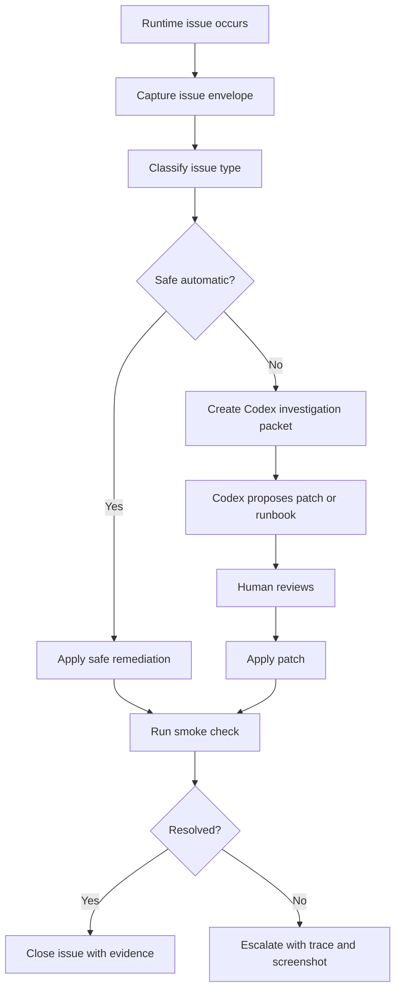

# Dynamic Issue Detection And Codex Remediation Plan

Date: 2026-04-15  
Status: Proposed  
Scope: Theme shell, Decision Inbox, approval actions, UI/API runtime failures, data freshness failures, Codex-assisted diagnosis

## 1. Why This Document Exists

The recent Decision Inbox audit exposed a product-level gap:

- The UI can show an action such as `Accept`.
- The backend can execute a real operation such as `add-rss`.
- The result can be `executed`, `skipped`, `already final`, or `failed`.
- Before the latest UI patch, the operator did not get enough structured feedback after clicking the button.
- If the failure was dynamic, the system did not automatically collect enough context for Codex to diagnose or propose a safe fix.

This is not just a button bug. It is a missing runtime feedback and remediation loop.

The goal is not to let Codex freely mutate the system. The goal is to make runtime issues reproducible, classifiable, reviewable, and safe to fix.

## 2. Concrete Example: Decision Inbox `Accept`

Example item:

```text
defense
approval | add-rss | human review
Fresh (3h ago)
Why shown: Human review required: add-rss
untrusted feed domain queued by self-heal: https://www.flightradar24.com/
```

Payload:

```json
{
  "url": "https://www.flightradar24.com/",
  "name": "Eastern Mediterranean Airspace and Tourism Risk source",
  "theme": "defense",
  "reason": "Codex theme proposal for Eastern Mediterranean Airspace and Tourism Risk"
}
```

When the operator clicks `Accept`, the expected path is:

1. Browser calls `POST /api/approval-queue/{id}/review`.
2. API loads the approval queue item.
3. API calls `executeProposal(...)`.
4. `executeProposal(...)` dispatches to `add-rss`.
5. `add-rss` evaluates feed quality.
6. If quality and budget allow it, the source is registered.
7. The URL is fetched and parsed as RSS/Atom.
8. Parsed items are inserted into `articles`.
9. Default article-theme rows are attached.
10. Approval row is marked `executed`.

Possible outcomes:

- `executed`: source was registered and article seeding succeeded.
- `skipped`: approval was accepted but feed quality, format, or policy rejected execution.
- `alreadyFinal`: the approval item was already processed.
- `failed`: request, parsing, schema, budget, or executor error occurred.

The operator must see which one happened. A generic "Action recorded" is not enough.

## 3. The Actual Problem Pattern

The system currently has many runtime surfaces:

- UI buttons and keyboard shortcuts.
- API routes.
- approval/proposal execution.
- source registry.
- persistent cache.
- PostgreSQL state.
- map iframes.
- theme/evidence snapshots.
- background automation.

Dynamic issues can occur between any two layers.

Typical failure modes:

- Button calls a missing or wrong JS function.
- Button is visible even though action is not valid for that item type.
- UI action succeeds locally but backend fails.
- Backend returns success but action was skipped.
- Backend executes but UI removes the item without showing what happened.
- API response shape changes and UI silently renders empty state.
- Fresh wrapper timestamp hides stale internal data.
- Topic metadata updates but linked evidence remains old.
- Third-party source fetch fails or is not RSS.
- Map iframe throws after surface teardown.
- Browser request is aborted during navigation and looks like a failure unless classified.

The product needs a runtime issue envelope so these cases are not lost.

## 4. Required Issue Envelope

Every important dynamic failure should be captured as a structured object.

Minimum fields:

```json
{
  "id": "runtime-issue-...",
  "createdAt": "2026-04-15T00:00:00.000Z",
  "surface": "decision-inbox",
  "action": "approval.accept",
  "itemType": "approval",
  "itemSubtype": "add-rss",
  "itemId": "123",
  "theme": "defense",
  "period": "quarter",
  "url": "http://127.0.0.1:4173/event-dashboard.html",
  "apiRoute": "/api/approval-queue/123/review",
  "requestBody": {
    "decision": "accept",
    "reviewer": "theme-dashboard"
  },
  "responseStatus": 500,
  "responseBody": {
    "error": "RSS fetch 403"
  },
  "pageErrors": [],
  "consoleErrors": [],
  "networkFailures": [],
  "screenshotPath": "tmp-playwright-inspect/...",
  "freshness": {
    "stale": false,
    "fallback": false
  },
  "classification": "external-dependency",
  "severity": "review",
  "safeRemediation": false
}
```

This object should be stored locally first. It can later become a DB table, but file-based capture is enough for phase 1.

Recommended local path:

```text
data/runtime-issues/YYYY-MM-DD/*.json
```

## 5. Issue Taxonomy

### 5.1 UI Wiring

Symptoms:

- `function is not defined`
- button does nothing
- wrong surface opens
- preview does not update
- keyboard shortcut calls invalid action

Likely remediation:

- patch UI function binding
- disable invalid button
- add action guard
- add Playwright regression

Auto-fix allowed:

- No, unless the patch is trivial and covered by smoke test.

### 5.2 API Contract

Symptoms:

- 404/500 from expected route
- response lacks required field
- `null` where UI assumes object
- success body does not identify `executed/skipped/failed`

Likely remediation:

- add response schema normalization
- add error envelope
- add UI state branch

Auto-fix allowed:

- No, but Codex can generate a patch candidate.

### 5.3 Action Semantics

Symptoms:

- `Accept` means different things for `proposal`, `approval`, `triage`, and `E2`.
- bulk action applies to incompatible item types.
- UI removes item even if backend did not execute.

Likely remediation:

- central action resolver
- type-specific action map
- disable invalid bulk buttons
- show execution result

Auto-fix allowed:

- Only UI-side guards.
- Never auto-execute approval actions.

### 5.4 Data Continuity

Symptoms:

- topic updated in 2026 but linked articles stop in 2025
- report fresh but evidence stale
- risk snapshot and structural alerts disagree

Likely remediation:

- add recent evidence fallback
- expose latest linked vs recent linked separately
- rebuild snapshot
- unify canonical source

Auto-fix allowed:

- Read-only detection and badge downgrade.
- Cache rebuild only if script is known safe.

### 5.5 Freshness And Trust

Symptoms:

- wrapper generated now but internal data old
- stale source displayed as live
- fallback window hidden

Likely remediation:

- propagate internal `updatedAt`
- centralize freshness classifier
- render trust row on every critical card

Auto-fix allowed:

- UI downgrade to stale/fallback badge.
- No data mutation.

### 5.6 External Dependency

Symptoms:

- RSS endpoint is not RSS
- 403/429/timeout
- map tile failure
- OpenSky rate limit

Likely remediation:

- classify dependency failure
- retry later
- disable noisy layer
- queue source for manual review

Auto-fix allowed:

- disable layer temporarily
- mark source as skipped or review-required
- no approval execution.

### 5.7 Performance

Symptoms:

- too many initial API calls
- map FPS drops
- expensive layer always on
- UI stalls during refresh

Likely remediation:

- lazy-load surface
- add LOD
- debounce layer build
- virtualize long lists

Auto-fix allowed:

- No direct code mutation.
- Codex can generate performance patch candidate.

## 6. Safe Remediation Policy

The system should have three remediation classes.

### Class A: Safe Automatic

Allowed without human approval:

- restart frontend dev server
- restart local dashboard API
- clear view-only UI cache
- downgrade stale/fallback badge
- disable invalid UI button
- suppress a known noisy non-critical map layer
- run read-only diagnostics

### Class B: Suggested Patch

Requires human review before applying:

- code changes
- API contract changes
- schema normalization
- Playwright regression addition
- snapshot builder logic change
- data continuity query change

### Class C: Never Automatic

Must not be auto-executed:

- `Accept` / `Reject` approval queue items
- source registration
- proposal execution
- DB destructive writes
- bulk reclassification
- investment decision promotion
- live source deletion

## 7. Codex Remediation Loop

Recommended flow:



Codex should receive a compact packet, not the whole repo blindly.

Packet contents:

- issue envelope JSON
- screenshot
- API response
- related console/page errors
- last 50 lines of server log
- relevant source files guessed by route/surface map
- exact reproduction steps

## 8. Route And Surface Map

Maintain a static map so the detector can identify likely files.

Example:

```json
{
  "decision-inbox": {
    "ui": ["event-dashboard.html"],
    "api": ["scripts/event-dashboard-api.mjs"],
    "executor": ["scripts/proposal-executor.mjs"],
    "state": ["scripts/_shared/approval-queue.mjs"]
  },
  "geo-lens": {
    "ui": ["event-dashboard.html", "event-map-lens.html"],
    "map": ["src/theme-map-lens.ts", "src/components/DeckGLMap.ts"],
    "api": ["scripts/event-dashboard-api.mjs"]
  },
  "theme-brief": {
    "ui": ["event-dashboard.html"],
    "queries": ["scripts/_shared/trend-dashboard-queries.mjs"]
  }
}
```

This is what lets Codex move fast without guessing.

## 9. Preflight Before Destructive Actions

Approval actions should support a UI-level preflight.

Current backend already has a `dryRun` path in the approval review flow:

```json
{
  "decision": "accept",
  "reviewer": "theme-dashboard",
  "dryRun": true
}
```

Recommended UI:

- `Simulate` button next to `Accept`.
- Show:
  - action type
  - target URL/source/theme
  - expected executor
  - quality threshold
  - likely outcome
  - whether action is destructive
  - whether it will write to DB/cache

Only after simulation should the operator press `Accept`.

This would have made the Flightradar24 case clearer:

- URL may not be RSS.
- registration may be skipped by quality threshold.
- article seeding may insert zero articles.
- the queue item may still become `executed` only if executor returns success.

## 10. Acceptance Criteria

Phase 1 is complete when:

- Every Decision Inbox action shows `executed/skipped/rejected/already final/failed`.
- Every failed action captures an issue envelope.
- Playwright smoke covers main surfaces and key actions.
- Invalid bulk actions are disabled.
- `dryRun` is available for approval actions.

Phase 2 is complete when:

- Runtime issue envelopes are stored locally.
- Codex can generate an investigation packet from an issue id.
- Known safe remediations can be suggested or applied.
- The user sees "what happened" and "what to do next" after every failed action.

Phase 3 is complete when:

- Codex can propose a patch and run smoke checks automatically.
- Patches remain human-approved by default.
- Destructive actions are never auto-executed.

## 11. Immediate Backlog

1. Add runtime issue envelope writer.
2. Add client-side action trace for Decision Inbox.
3. Add `Simulate` button for approval actions using `dryRun`.
4. Add Playwright smoke for:
   - surface switch
   - single approval accept dry-run
   - action result banner
   - invalid mixed bulk selection
   - stale/fallback visible states
5. Add `runtime-issue -> related files` route map.
6. Add Codex investigation packet generator.
7. Add safe remediation policy check before any automated fix.

## 12. Key Principle

Codex should not be allowed to "just fix the app" from a vague runtime failure.

The system should first capture:

- what the operator clicked
- what the UI expected
- what the API returned
- what data was stale or missing
- what screenshot proves the failure
- what files are likely relevant

Then Codex can make a targeted, reviewable patch.

This is the difference between AI-assisted operations and unsafe auto-mutation.

