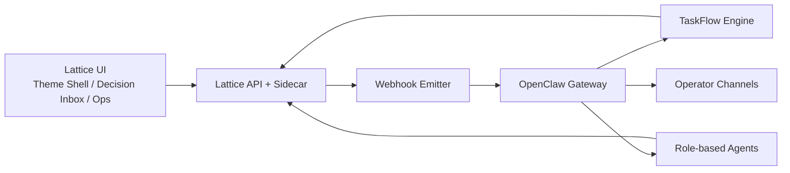

# OpenClaw Integration Architecture

Date: 2026-04-16 KST  
Status: active  
Scope: OpenClaw Gateway, Webhooks, TaskFlow, channel automation, operator briefing, source repair, scheduler recovery

## 1. Executive Summary

Lattice Current already has the hard parts of the product:

- evidence-backed operator UI
- approval and discovery review loops
- source probing and guarded ingestion
- scheduler and replay workflows
- sidecar-backed local runtime and observability
- live vs delayed vs backfill data semantics

OpenClaw should not replace that core.

The correct integration model is:

```text
Lattice Current = system of record for evidence, data quality, review state, and product UI
OpenClaw = communication, agent orchestration, channel delivery, and long-running workflow control plane
```

This gives us three immediate gains:

1. Channel-native review and alert delivery without rebuilding chat infrastructure.
2. Durable multi-step automation using Webhooks + TaskFlow instead of ad hoc retry scripts.
3. Stronger briefing output through role-specific agents that consume existing Lattice evidence surfaces.

## 2. Design Principle

### 2.1 Source of truth

Lattice remains the only source of truth for:

- approval status
- proposal status
- source registry state
- ingestion results
- freshness classification
- brief evidence payloads
- replay and validation outputs

OpenClaw may read these surfaces and trigger guarded actions, but it must not become a second state authority.

### 2.2 Control plane boundary

OpenClaw owns:

- inbound operator requests from channels
- outbound alerts and digests
- long-running orchestration state
- agent routing by role and channel
- tool invocation against Lattice APIs

### 2.3 Automation rule

Read, summarize, classify, retry, and draft can be automated aggressively.

Approve, register, mutate, or suppress should remain guarded by one of:

- deterministic policy gate
- explicit operator approval
- privileged agent profile with a narrow write scope

## 3. Capability Comparison

The main question is not whether OpenClaw can execute coding tools.
It can.

The real question is whether the current Lattice repository already has a closed remediation loop, and whether OpenClaw improves that loop enough to justify the added trust surface.

| Capability | Lattice only, current state | Lattice + OpenClaw control plane | Notes |
| --- | --- | --- | --- |
| Runtime failure detection | partial | strong | Lattice already has freshness audit, queue states, and runtime issue planning, but OpenClaw adds channel/event intake and durable flow routing. |
| Deterministic source retry | partial | strong | Lattice has probe, repair, simulate, and self-heal pieces. OpenClaw can orchestrate repeated repair attempts and notifications through TaskFlow. |
| Scheduler retry and recovery | partial | strong | Lattice has retry/backoff and service wrappers. OpenClaw adds durable failure classification, follow-up, and operator escalation. |
| Daily and weekly briefing | medium | strong | Lattice already has evidence payloads. OpenClaw improves delivery, routing, and role-specific summaries. |
| Multi-role agent separation | weak | strong | Lattice currently relies on manual operator context. OpenClaw provides role-separated agents and session routing. |
| Chat-native approval review | weak | strong | Lattice has the review state and UI, but not the channel surface. |
| Automatic code patching | weak | medium, if enabled deliberately | OpenClaw can technically invoke coding tools, but this should not be enabled in the default integration profile. |
| Auditability of code changes | strong | medium by default | Git and local transcript remain stronger than channel-driven coding unless a strict patch approval workflow is added. |
| Blast-radius control for remote coding | strong | weak by default | OpenClaw remote coding requires explicit hardening to reach parity with local Codex workflows. |

## 4. Current Lattice Integration Seams

The following files already define the right attachment points.

### 4.1 Operator API plane

- [scripts/event-dashboard-api.mjs](C:\Users\chohj\Documents\Playground\lattice-current-fix\scripts\event-dashboard-api.mjs)
  - health and runtime status
  - KPI summary and live status
  - approval queue and discovery triage
  - theme brief and snapshot payloads
  - freshness audit and automation log surfaces

Important confirmed route anchor:

- `/api/health` at [scripts/event-dashboard-api.mjs](C:\Users\chohj\Documents\Playground\lattice-current-fix\scripts\event-dashboard-api.mjs):2255

### 4.2 Approval and proposal execution plane

- [scripts/_shared/approval-queue.mjs](C:\Users\chohj\Documents\Playground\lattice-current-fix\scripts\_shared\approval-queue.mjs)
  - `getPendingApprovals`
  - `loadApprovalById`
  - `markApprovalReviewed`
- [scripts/proposal-executor.mjs](C:\Users\chohj\Documents\Playground\lattice-current-fix\scripts\proposal-executor.mjs)
  - `reviewCodexProposalById`
  - `executeProposal`
  - `handleAddRssDryRun`
  - `handleAddRss`

### 4.3 Source repair plane

- [scripts/self-heal-sources.mjs](C:\Users\chohj\Documents\Playground\lattice-current-fix\scripts\self-heal-sources.mjs)
- [scripts/_shared/source-probe.mjs](C:\Users\chohj\Documents\Playground\lattice-current-fix\scripts\_shared\source-probe.mjs)
- [scripts/source-adapter-proposal.mjs](C:\Users\chohj\Documents\Playground\lattice-current-fix\scripts\source-adapter-proposal.mjs)
- [docs/SOURCE_PROPOSAL_INGESTION_REDESIGN_2026-04-16.md](C:\Users\chohj\Documents\Playground\lattice-current-fix\docs\SOURCE_PROPOSAL_INGESTION_REDESIGN_2026-04-16.md)

### 4.4 Scheduler and unattended automation plane

- [scripts/intelligence-scheduler.mjs](C:\Users\chohj\Documents\Playground\lattice-current-fix\scripts\intelligence-scheduler.mjs)
- [src/services/server/intelligence-automation.ts](C:\Users\chohj\Documents\Playground\lattice-current-fix\src\services\server\intelligence-automation.ts)
- [docs/automation-runbook.md](C:\Users\chohj\Documents\Playground\lattice-current-fix\docs\automation-runbook.md)

### 4.5 Local runtime and desktop control plane

- [src-tauri/sidecar/local-api-server.mjs](C:\Users\chohj\Documents\Playground\lattice-current-fix\src-tauri\sidecar\local-api-server.mjs)
  - `/api/local-source-hunt`
  - `/api/local-intelligence-replay`
  - `/api/local-automation-ops-snapshot`
  - `/api/local-runtime-observability`
  - `/api/local-intelligence-run-scheduler-now`
  - `/api/local-env-update`
  - `/api/local-runtime-secrets`
  - `/api/local-validate-secret`
- [src/services/runtime.ts](C:\Users\chohj\Documents\Playground\lattice-current-fix\src\services\runtime.ts)
- [src/services/runtime-config.ts](C:\Users\chohj\Documents\Playground\lattice-current-fix\src\services\runtime-config.ts)

## 5. Target Architecture



### 5.1 Lattice responsibilities

- provide normalized evidence payloads
- provide guarded write endpoints
- emit automation events
- persist execution outcomes
- expose freshness, degradation, and replay context

### 5.2 OpenClaw responsibilities

- receive events from Lattice through webhooks
- route work into TaskFlow state machines
- invoke Lattice tools and read APIs
- deliver briefings and review prompts to operator channels
- maintain role-separated agent sessions

### 5.3 Who writes to NAS

OpenClaw is not the default NAS writer.

The intended runtime path is:

```text
operator or channel request
-> OpenClaw tool or TaskFlow
-> Lattice API / sidecar / scheduler / executor
-> Lattice-owned code writes to NAS PostgreSQL
```

That is different from exposing a generic SQL lane where OpenClaw can issue arbitrary database writes directly.

The default write authority remains inside Lattice-owned services and scripts.

Typical write-capable paths today are:

- [scripts/event-dashboard-api.mjs](C:\Users\chohj\Documents\Playground\lattice-current-fix\scripts\event-dashboard-api.mjs)
- [scripts/proposal-executor.mjs](C:\Users\chohj\Documents\Playground\lattice-current-fix\scripts\proposal-executor.mjs)
- [scripts/self-heal-sources.mjs](C:\Users\chohj\Documents\Playground\lattice-current-fix\scripts\self-heal-sources.mjs)
- [scripts/intelligence-scheduler.mjs](C:\Users\chohj\Documents\Playground\lattice-current-fix\scripts\intelligence-scheduler.mjs)
- [src/services/server/intelligence-automation.ts](C:\Users\chohj\Documents\Playground\lattice-current-fix\src\services\server\intelligence-automation.ts)

Examples:

- approval review
  - OpenClaw calls a guarded review tool
  - Lattice loads the approval and executes the proposal
  - Lattice updates approval state and related NAS rows
- source repair
  - OpenClaw starts the repair flow
  - Lattice probe and executor modules evaluate and register
  - Lattice writes registry and seeded article rows if policy allows it
- scheduler retry
  - OpenClaw starts retry flow
  - Lattice scheduler runs
  - Lattice writes run state, artifacts, and outcome rows

The short version is:

```text
OpenClaw = caller and orchestrator
Lattice = default NAS writer
```

## 6. Webhook Event Model

Lattice should emit a small, explicit event envelope rather than pushing raw DB state.

Recommended event shape:

```json
{
  "eventId": "evt-2026-04-16-...",
  "eventType": "approval-needs-fix",
  "createdAt": "2026-04-16T09:12:31.000Z",
  "source": "lattice-current",
  "severity": "review",
  "theme": "defense",
  "entityType": "approval",
  "entityId": "approval-84",
  "surface": "decision-inbox",
  "summary": "Source candidate requires repair before registration",
  "deepLink": "/event-dashboard.html#decision-inbox",
  "payload": {
    "proposalKind": "add-rss",
    "url": "https://www.hellenicshippingnews.com/",
    "resolvedUrl": "https://www.hellenicshippingnews.com/feed/",
    "status": "needs-fix",
    "qualityScore": 0.783
  }
}
```

Recommended initial event types:

- `approval-created`
- `approval-reviewed`
- `approval-needs-fix`
- `source-probe-failed`
- `source-repaired`
- `source-rejected`
- `source-registered`
- `scheduler-cycle-started`
- `scheduler-cycle-completed`
- `scheduler-cycle-failed`
- `freshness-audit-raised`
- `brief-daily-ready`
- `brief-weekly-ready`

## 7. Tool Contract Exposed To OpenClaw

OpenClaw tools should be explicit and narrow. Do not expose generic DB access.

### 7.1 Read tools

- `lattice.get_health`
- `lattice.get_kpi_summary`
- `lattice.get_live_status`
- `lattice.get_theme_brief`
- `lattice.get_approval_queue`
- `lattice.get_discovery_triage`
- `lattice.get_freshness_audit`
- `lattice.get_runtime_observability`
- `lattice.get_local_automation_ops`
- `lattice.get_source_probe_result`

### 7.2 Write tools

- `lattice.simulate_approval`
- `lattice.review_approval`
- `lattice.review_discovery_topic`
- `lattice.run_scheduler_now`
- `lattice.trigger_source_probe`
- `lattice.trigger_source_repair_plan`

These are service-shaped actions, not generic database tools.

The intended model is:

```text
OpenClaw tool
-> narrow Lattice action
-> internal policy / validation
-> Lattice-owned NAS write if allowed
```

### 7.3 Write guard

OpenClaw write tools must enforce:

- item-type-specific action maps
- dry-run before irreversible registration where supported
- operator identity or privileged agent identity
- reason logging
- deep-link echo back to the Lattice UI

## 8. TaskFlow Automation Programs

The strongest value comes from durable TaskFlow orchestration. The following flows should be first-class.

### 8.1 Source Repair Flow

Purpose:

- recover valid feed-like sources automatically
- avoid polluting the operator queue with obviously broken candidates
- surface only high-signal repair-required items to humans

Trigger:

- `source-probe-failed`
- `approval-needs-fix`
- `source-repair-requested`

Flow:

1. Load proposal and previous probe result.
2. Run deterministic repair pass.
   - same-domain alternate feed discovery
   - `/feed`, `/rss`, `/atom.xml`, sitemap, alternate link checks
3. Re-probe candidate URLs.
4. If quality clears threshold, mark as `repair-success`.
5. If still blocked, ask repair agent for structured adapter proposal.
6. Re-run probe with repaired strategy if safe.
7. If still blocked, emit `needs-review`.
8. Send a concise operator summary with:
   - original URL
   - resolved URL
   - connector kind
   - quality score
   - sample items
   - recommended action

Automation level:

- deterministic repair: automatic
- LLM repair proposal: automatic
- final registration: guarded by existing Lattice policy or privileged approval profile

### 8.2 Scheduler Retry Flow

Purpose:

- recover unattended automation when a cycle fails
- reduce dead periods caused by provider, lock, or transient runtime issues

Trigger:

- `scheduler-cycle-failed`
- `freshness-audit-raised`
- local runtime observability alarm

Flow:

1. Read scheduler state and last failure class.
2. Classify as:
   - provider/auth
   - lock/stale lock
   - transient network
   - schema mismatch
   - rate limit
   - runtime crash
3. If safe, run bounded retry:
   - immediate if transient
   - exponential backoff if repeated
4. If local runtime is unhealthy, invoke sidecar observability and secret validation.
5. If retry succeeds, emit `scheduler-cycle-recovered`.
6. If retry fails twice, create an operator incident brief.

Automation level:

- retry and classification: automatic
- credential mutation: never automatic
- environment edits: only via explicit operator step

### 8.3 Daily Brief Flow

Purpose:

- produce a concise operator-ready daily brief without opening the dashboard first
- highlight actionable change, not just raw metrics

Trigger:

- scheduled every day after the primary morning refresh window
- manual run from operator chat

Inputs:

- KPI summary
- live status
- approval queue deltas
- discovery triage deltas
- structural alerts
- freshness audit
- top theme brief payloads

Output structure:

1. `Now`
   - risk posture
   - delayed/backfill warnings
2. `What changed`
   - strongest new themes
   - new approvals needing action
   - new repair-required sources
3. `Why it matters`
   - evidence-backed explanation from theme briefs
4. `What needs action today`
   - top 3 approval or triage items
5. `Operator risks`
   - stale quote path
   - mirrored signals
   - failed scheduler cycles

Delivery:

- OpenClaw channel post
- Control UI thread
- optional notebook artifact in Lattice later

### 8.4 Weekly Brief Flow

Purpose:

- generate a structural operating brief, not a headline recap
- compress the week into validated directional changes

Trigger:

- weekly scheduled TaskFlow

Inputs:

- weekly theme deltas
- structural alerts
- validation snapshots
- replay / calibration summaries
- source-repair outcomes
- approval throughput

Output structure:

1. `Structural shifts`
2. `Validated themes that strengthened`
3. `Signals that degraded or lost freshness`
4. `Approval and source quality summary`
5. `Recommended watchlist changes`
6. `Open operational risks`

Delivery:

- executive agent summary
- operator agent full brief
- deep links into Lattice Theme Brief and Ops surfaces

### 8.5 Failed Ingestion Recovery Flow

Purpose:

- recover when ingestion failed after approval or after registration
- prevent silent dead sources and misleading freshness

Trigger:

- `source-registered` followed by zero seeded items
- repeated fetch failure on approved source
- source quality collapse from freshness audit

Flow:

1. Inspect most recent ingestion result.
2. Re-probe the current registered URL.
3. Check if alternate resolved URL now exists.
4. If a same-domain feed candidate is stronger, propose safe swap.
5. If ingestion still fails, downgrade source health and emit alert.
6. If source is structurally incompatible, mark for manual review.

Automation level:

- recovery classification: automatic
- safe same-domain feed swap: policy-controlled
- source disable or replacement: privileged review only

### 8.6 Reporting architecture foundation

OpenClaw does not need a separate report engine to produce stronger reporting.

The right model is to combine:

- Standing Orders
- TaskFlow
- Agent Workspace
- Memory files
- isolated sessions
- diff artifacts

This produces repeatable reports with operational context instead of one-off chat summaries.

#### Report families

Recommended initial report families:

`Daily Brief`

- purpose
  - explain current posture
  - compress the top signal changes into one morning read
  - point directly to today's approval and repair workload
- inputs
  - KPI summary
  - live status
  - freshness audit
  - approval queue delta
  - discovery triage delta
  - top theme briefs
- output shape
  - `Now`
  - `What changed`
  - `Why it matters`
  - `What needs action today`
  - `Operational caveats`

`Weekly Structural Brief`

- purpose
  - summarize structural change instead of daily noise
  - capture validated strengthening and weakening
  - update watchlist direction
- inputs
  - structural alerts
  - theme evolution deltas
  - validation snapshot
  - source quality and repair summary
  - approval throughput summary
- output shape
  - `Structural shifts`
  - `Validated themes that strengthened`
  - `Signals that degraded`
  - `Source and ingestion quality`
  - `Watchlist changes`
  - `Open risks`

`Incident Report`

- purpose
  - package runtime failures into one readable artifact
  - support rapid operator escalation
- inputs
  - scheduler failure
  - freshness audit alert
  - runtime observability snapshot
  - failed ingestion signals
  - latest retry attempt
- output shape
  - `Incident summary`
  - `Impact`
  - `Probable cause`
  - `Actions taken`
  - `Current state`
  - `Next action`

`Repair Report`

- purpose
  - summarize source repair or remote coding work
  - prove what changed and what validation passed
- inputs
  - source probe result
  - resolved URL or adapter plan
  - validation output
  - diff artifact for any code repair
- output shape
  - `Original problem`
  - `Repair action`
  - `Validation result`
  - `Residual risk`
  - `Recommended disposition`

#### Standing Orders as report programs

Reports should be implemented as named Standing Orders, not free-form prompts.

Recommended initial programs:

- `Daily Operator Brief`
- `Weekly Structural Brief`
- `Scheduler Incident Report`
- `Source Repair Report`
- `Remote Coding Repair Report`

Each program should define:

- trigger
- authority
- approval gate
- escalation rule
- execution steps
- what not to do

Recommended trigger mapping:

- time-based
  - daily and weekly briefs
- event-based
  - incident reports
  - repair reports

#### Agent Workspace file layout

Report outputs should live in the agent workspace as durable artifacts.

Recommended layout:

```text
Reports/
  daily/YYYY-MM-DD.md
  weekly/YYYY-WW.md
  incidents/<incident-id>.md
  repairs/<repair-id>.md
Reports/Artifacts/
  screenshots/
  diffs/
  logs/
Agent/Logs/
  report-runs/
```

This gives the reporting system:

- stable file outputs
- attachment-ready artifacts
- historical comparability

#### Memory discipline for reporting

OpenClaw memory is file-based, so report quality improves when report rules are written into memory explicitly.

Recommended usage:

- `MEMORY.md`
  - preferred tone
  - mandatory sections
  - executive summary style
  - terms that must map to `live`, `delayed`, `backfill`, or `fallback`
- daily memory files
  - unresolved watch items
  - repeated false alarms
  - anomalies that should persist into the next report

#### Session split for report generation

Do not generate every report inside one noisy session.

Recommended split:

- `collector-session`
  - gathers payloads from Lattice tools
- `analyst-session`
  - interprets evidence and ranks importance
- `writer-session`
  - writes the final report
- `exec-summary-session`
  - compresses the long report into a short executive brief

#### Delivery model

Reports should ship in two layers:

- channel summary
  - short message
  - top action items
  - top risk
  - deep link back to Lattice
- report artifact
  - markdown file
  - optional PDF or screenshot pack
  - optional diff artifact

#### Diff artifacts for report comparison

The `diffs` plugin should be used for report comparison, not only code review.

Recommended use cases:

- yesterday vs today Daily Brief
- previous vs current Weekly Structural Brief
- before vs after source repair report
- before vs after remote coding repair report

#### Reporting success criteria

The reporting system is working only if:

- every scheduled report is generated from explicit Lattice evidence contracts
- every incident report points to current state and next action
- every repair report includes validation, not just narrative
- every daily and weekly report has a durable file artifact
- channel delivery stays concise and links back to the evidence surface

## 9. Agent Roles And Session Strategy

Use separate OpenClaw agents instead of one omnipotent assistant.

### 9.1 Ops agent

Responsibilities:

- scheduler status
- freshness audit interpretation
- retry decisions
- runtime health summaries

Write scope:

- scheduler retry
- read-only diagnostics

### 9.2 Review agent

Responsibilities:

- approval queue inspection
- discovery triage summaries
- dry-run and evidence preview

Write scope:

- simulate
- guarded approval/discovery review

### 9.3 Source repair agent

Responsibilities:

- failed source analysis
- adapter repair plan
- ingestion recovery flow

Write scope:

- probe
- repair plan generation
- no direct credential or registry mutation without guard

### 9.4 Briefing agent

Responsibilities:

- daily brief
- weekly brief
- theme evidence narration

Write scope:

- none

Session routing guidance:

- operator DMs -> review or ops agent
- daily channel digest -> briefing agent
- source repair queue -> source repair agent
- privileged maintainer channel -> review + ops agent only

## 10. Security Model

OpenClaw introduces a stronger orchestration surface, so the trust boundary must stay narrow.

Rules:

- Gateway token is operator-grade secret material.
- OpenClaw plugin code is trusted code and must be repo-controlled.
- Lattice write tools must be allowlisted explicitly.
- No generic SQL or shell tool should be exposed through the OpenClaw integration plugin.
- Credentials remain in existing runtime-config and sidecar secret paths.
- Approval, registration, suppression, and environment mutation all require explicit policy or privileged agent profile.

Do not build a shared multi-tenant gateway for this integration.

### 10.1 Why generic coding tools stay out of the default integration

OpenClaw can technically run coding tools similar to the current Codex environment.

That is not a reason to expose them by default.

The official Tools Invoke HTTP API applies a hard deny list by default for exactly this reason. The default denied tools include:

- `exec`
- `spawn`
- `shell`
- `fs_write`
- `fs_delete`
- `fs_move`
- `apply_patch`
- `sessions_spawn`
- `sessions_send`
- `cron`
- `gateway`
- `nodes`

This default is a deliberate warning sign, not an inconvenience.

Remote coding through message channels combines three separate risks.

#### A. Trust boundary collapse

If a shared-secret Gateway credential or trusted-proxy route is exposed through an untrusted chat surface, the caller is no longer asking for a summary. The caller is effectively stepping into operator-grade execution scope.

That makes the following chain possible:

```text
channel compromise
-> injected command request
-> tool invocation
-> file mutation or command execution
-> codebase or host damage
```

#### B. Audit degradation

Chat logs do not replace engineering audit trails.

Local Codex/Codex app workflows preserve:

- full engineering transcript
- staged diff review
- explicit test runs
- git history and commit messages

Channel-driven coding often degrades into:

- vague natural-language intent
- ambiguous or missing test evidence
- scattered reasoning across message threads

#### C. Mistake blast radius

The problem is not only malicious use.

It is also ordinary operational error:

- branch confusion
- wrong working directory
- mistaken production credentials
- accidental destructive shell usage
- over-broad patch requests

### 10.2 Position for this repository

Default policy:

- OpenClaw is allowed to read, summarize, classify, retry, and draft.
- OpenClaw is allowed to trigger guarded Lattice actions through narrow tools.
- OpenClaw is not allowed to expose generic shell or filesystem mutation through the default `lattice-control-plane` integration.
- OpenClaw is not intended to be a generic NAS SQL writer in the default integration.

This repository should treat remote coding as an exceptional mode, not the base integration path.

### 10.3 If remote coding is ever enabled

If a future `lattice-coder` profile is created, it must be separate from the default operator integration.

Minimum hardening:

- separate agent profile
- separate feature-branch worktree
- no direct `main` or `master` writes
- no `git push --force`
- no generic DB write access
- no secret mutation
- all file diffs posted back for review
- no commit or push without explicit approval state
- explicit command allowlist instead of broad shell enablement

Recommended operating model:

```text
default OpenClaw integration
-> approvals, source repair, scheduler recovery, briefing

separate lattice-coder profile
-> isolated worktree
-> patch proposal
-> tests
-> human approval
-> commit
```

Even in the remote coding lane, the normal write path to NAS does not change.

The coder lane may modify Lattice code in an isolated worktree.
After review and merge, the modified Lattice processes may later write to NAS through the existing app paths.

That is different from making OpenClaw itself the generic database writer.

The correct mental model is:

```text
OpenClaw coder
-> modifies Lattice code in isolated worktree
-> approved code is merged
-> deployed Lattice process writes to NAS through existing service paths
```

### 10.4 Remote coding lane requirements

The `lattice-coder` lane is not a generic shell escape hatch.

It is a controlled patch pipeline with strict boundaries.

Required properties:

- one coding request maps to one isolated worktree
- one worktree maps to one feature branch
- the agent never edits the primary checkout directly
- all mutations happen through an explicit patch step
- validation artifacts are required before approval
- commit and push are blocked until review state becomes `approved`

Minimum lane components:

- `coder-profile`
  - privileged agent profile used only for coding tasks
- `worktree-manager`
  - creates and disposes isolated feature-branch worktrees
- `taskflow-runner`
  - orchestrates patch, validation, and approval states
- `artifact-store`
  - stores diff summary, test logs, screenshots, and status
- `approval-gate`
  - blocks commit and push until explicit approval

### 10.5 Remote coding state machine

```text
requested
-> triaged
-> worktree-created
-> patch-generated
-> validation-running
-> validation-failed | validation-passed
-> review-pending
-> approved | rejected | needs-rework
-> commit-ready
-> committed
-> push-approved
-> pushed
-> merged externally
```

The critical rule is simple:

```text
no commit before review approval
no push before explicit push approval
no merge from the remote coding lane
```

### 10.6 Remote coding command allowlist

The coder lane should not receive broad shell access.

It should receive a narrow allowlist built around:

- read repository state
- create a feature branch worktree
- edit files with patch-style tools
- run bounded validation
- report artifacts

Recommended allowlist categories:

- git read commands
  - `git status --short`
  - `git diff`
  - `git rev-parse`
  - `git branch --show-current`
- worktree creation commands
  - `git worktree add`
  - `git worktree remove`
  - `git switch -c`
- repository inspection
  - `Get-ChildItem`
  - `Select-String`
  - `Get-Content`
  - `rg`
- bounded validation
  - `npm run typecheck`
  - `npm run build`
  - targeted `node --test ...`
  - targeted `npx playwright test ...`
- artifact emission
  - screenshot capture
  - log capture

Recommended hard deny list:

- `git push --force`
- `git reset --hard`
- `git checkout --`
- branch deletion on protected branches
- unrestricted `rm`, `Remove-Item -Recurse`, or equivalent
- direct DB mutation commands
- secret editing commands
- environment mutation outside the isolated worktree

### 10.7 Worktree policy

Every remote coding task must execute in a disposable feature worktree.

Recommended naming:

```text
codex/remote-fix-<issue-id>
```

Recommended path pattern:

```text
<repo-root>\\.worktrees\\remote-fix-<issue-id>
```

Rules:

- branch prefix must never be `main` or `master`
- worktree must be created from a known clean base ref
- existing dirty primary checkout must not be reused
- worktree teardown happens only after artifacts are persisted

### 10.8 Validation contract

Remote coding only becomes useful if it proves the patch, not just writes it.

Each coding run must produce:

- `diffSummary`
- `filesChanged`
- `commandsRun`
- `testResults`
- `buildStatus`
- `screenshotPaths` when UI changed
- `openRisks`
- `recommendation`

Minimum validation ladder:

1. syntax or typecheck
2. targeted unit/integration tests
3. Playwright for UI or workflow changes
4. screenshot or artifact diff when relevant

If any required validation step fails, state must move to `needs-rework`, not `commit-ready`.

### 10.9 Approval UX for remote coding

The operator should never approve an invisible patch.

The approval payload should show:

- task summary
- changed files
- concise diff summary
- tests run and pass/fail state
- screenshot thumbnails for UI changes
- branch name
- worktree path
- commit message proposal

Minimum approval actions:

- `approve-patch`
- `reject-patch`
- `request-rework`
- `approve-commit`
- `approve-push`

This is intentionally two-step:

```text
approve patch
-> commit allowed

approve push
-> push allowed
```

## 11. Remote Coding Decision

For this repository, the default answer is:

```text
OpenClaw should improve operations and briefing first.
It should not become the default remote code-editing path.
```

That keeps the integration aligned with the highest-ROI use cases:

- source repair
- scheduler retry
- daily brief
- weekly brief
- failed ingestion recovery

and avoids turning a control-plane integration into an avoidable remote-RCE surface.

## 12. Implementation Plan

### Phase 1: Read-only integration

Deliver:

- OpenClaw plugin that wraps Lattice read APIs
- operator can query health, freshness, approvals, theme briefs
- channel notifications for audit and approval deltas

Current implementation status:

- plugin scaffold created at [../plugins/openclaw-lattice-control-plane](C:\Users\chohj\Documents\Playground\lattice-current-fix\plugins\openclaw-lattice-control-plane)
- native entrypoint implemented in [../plugins/openclaw-lattice-control-plane/index.ts](C:\Users\chohj\Documents\Playground\lattice-current-fix\plugins\openclaw-lattice-control-plane\index.ts)
- visible plugin-owned operator surface added at:
  - `http://127.0.0.1:18789/plugins/lattice`
  - JSON snapshot: `http://127.0.0.1:18789/plugins/lattice/api/snapshot`
- manifest and config schema defined in [../plugins/openclaw-lattice-control-plane/openclaw.plugin.json](C:\Users\chohj\Documents\Playground\lattice-current-fix\plugins\openclaw-lattice-control-plane\openclaw.plugin.json)
- local sample config added in [../plugins/openclaw-lattice-control-plane/openclaw-lattice-control-plane.sample.toml](C:\Users\chohj\Documents\Playground\lattice-current-fix\plugins\openclaw-lattice-control-plane\openclaw-lattice-control-plane.sample.toml)
- usage and install notes added in [../plugins/openclaw-lattice-control-plane/README.md](C:\Users\chohj\Documents\Playground\lattice-current-fix\plugins\openclaw-lattice-control-plane\README.md)
- local smoke validation script added in [../plugins/openclaw-lattice-control-plane/smoke-check.mjs](C:\Users\chohj\Documents\Playground\lattice-current-fix\plugins\openclaw-lattice-control-plane\smoke-check.mjs)

Validated on 2026-04-16:

- `npx tsc -p plugins/openclaw-lattice-control-plane/tsconfig.json`
- `npm run smoke` inside the plugin directory
- dashboard read-only endpoints returned live JSON successfully
- OpenClaw CLI installed locally as `openclaw 2026.4.14`
- local Gateway paired and healthy on `127.0.0.1:18789`
- `openclaw plugins install -l ...` completed for the Lattice plugin
- `openclaw plugins inspect openclaw-lattice-control-plane --json` returned `loaded`
- `GET /plugins/lattice` returned `200`
- `GET /plugins/lattice/api/snapshot` returned operator JSON with live Lattice data and recent OpenClaw artifacts
- `POST /tools/invoke` successfully executed:
  - `lattice.get_health`
  - `lattice.get_kpi_summary`
  - `lattice.get_approval_queue`
  - `lattice.get_theme_brief`

Success criteria:

- no write path enabled
- operator can get useful system state from chat without opening raw logs

### Phase 2: Guarded review actions

Deliver:

- `simulate_approval`
- `review_approval`
- `review_discovery_topic`
- deep-link echo from OpenClaw response back to `event-dashboard.html`

Current implementation status:

- guarded write tools added to [../plugins/openclaw-lattice-control-plane/index.ts](C:\Users\chohj\Documents\Playground\lattice-current-fix\plugins\openclaw-lattice-control-plane\index.ts)
  - `lattice.simulate_approval`
  - `lattice.review_approval`
  - `lattice.review_discovery_topic`
- plugin metadata updated in:
  - [../plugins/openclaw-lattice-control-plane/openclaw.plugin.json](C:\Users\chohj\Documents\Playground\lattice-current-fix\plugins\openclaw-lattice-control-plane\openclaw.plugin.json)
  - [../plugins/openclaw-lattice-control-plane/README.md](C:\Users\chohj\Documents\Playground\lattice-current-fix\plugins\openclaw-lattice-control-plane\README.md)
- live validation completed through:
  - `POST /tools/invoke`
  - `openclaw agent --agent main ...`
- confirmed live behaviors:
  - simulate on approval `68` returned resolved URL `https://www.hellenicshippingnews.com/feed/`
  - reject on approval `78` persisted as `rejected`
  - discovery topic `dt-c47a4d7c962b` persisted a `watch` review
- OpenClaw CLI agent default now runs through local `codex-cli/gpt-5.4`
- validated live:
  - `openclaw agent --agent main --message "Reply with the single word ok." --json`
  - `openclaw agent --agent main --message "Use the lattice.get_health tool and report only the status field." --json`

Success criteria:

- operator can review from chat
- Lattice remains authoritative for result persistence

### Phase 3: TaskFlow automation

Deliver:

- source repair flow
- scheduler retry flow
- failed ingestion recovery flow
- daily and weekly briefing flows

Current implementation status:

- shared emitter added at [../scripts/_shared/openclaw-webhook-emitter.mjs](C:\Users\chohj\Documents\Playground\lattice-current-fix\scripts\_shared\openclaw-webhook-emitter.mjs)
- emitter unit coverage added at [../tests/openclaw-webhook-emitter.test.mjs](C:\Users\chohj\Documents\Playground\lattice-current-fix\tests\openclaw-webhook-emitter.test.mjs)
- `add-rss` execution now emits:
  - `source-probe-failed`
  - `approval-created`
  - `source-rejected`
  - `source-registered`
  from [../scripts/proposal-executor.mjs](C:\Users\chohj\Documents\Playground\lattice-current-fix\scripts\proposal-executor.mjs)
- self-heal execution now emits:
  - `source-probe-failed`
  - `approval-created`
  - `source-repaired`
  - `source-rejected`
  from [../scripts/self-heal-sources.mjs](C:\Users\chohj\Documents\Playground\lattice-current-fix\scripts\self-heal-sources.mjs)
- scheduler automation now emits:
  - `scheduler-cycle-failed`
  - `scheduler-cycle-completed`
  - `brief-ready`
  from [../src/services/server/intelligence-automation.ts](C:\Users\chohj\Documents\Playground\lattice-current-fix\src\services\server\intelligence-automation.ts)
- bundled OpenClaw `webhooks` plugin enabled locally and configured with route:
  - `POST http://127.0.0.1:18789/plugins/webhooks/lattice`
- local emitter config written to ignored runtime file:
  - `data/openclaw-webhook.json`
- live validation completed:
  - direct `create_flow` webhook call returned `ok: true`
  - `emitOpenClawEvent(...)` in `taskflow` mode created a managed TaskFlow
  - `openclaw tasks flow list` showed queued flows owned by controller `webhooks/lattice`
  - `executeProposal(... add-rss ...)` on a rejected source produced a real `source-probe-failed` TaskFlow
- detached OpenClaw execution bridge added at:
  - [../scripts/_shared/openclaw-agent-dispatch.mjs](C:\Users\chohj\Documents\Playground\lattice-current-fix\scripts\_shared\openclaw-agent-dispatch.mjs)
- emitter now supports `dispatchAgent=true` and writes execution artifacts under:
  - `data/openclaw-agent-runs/`
- current local runtime config enables both:
  - TaskFlow bookkeeping through `create_flow`
  - real background `openclaw agent` dispatch through the helper bridge
- local runtime config now keeps `runTask=false` to avoid accumulating dead ACP queue rows for webhook-created tasks
- OpenClaw service config now defaults agent runtime to `codex-cli/gpt-5.4` while retaining the older `claude-cli` backend as fallback-only local config
- live validation completed:
  - a `brief-ready` event created a managed TaskFlow entry
  - the same event spawned a real `cli` background task in `openclaw tasks list`
  - the resulting brief artifact was written to `data/openclaw-agent-runs/<event-id>.result.json`
  - a `scheduler-cycle-failed` event also produced a real OpenClaw background analysis run

Important current constraint:

- `webhooks -> run_task` does **not** execute the task body
- it only writes the TaskFlow/task ledger rows
- real execution currently comes from the detached `openclaw agent` bridge
- channel delivery is not wired yet; outputs currently land in:
  - OpenClaw task history
  - local JSON artifacts

Success criteria:

- repeated recoverable failures no longer require manual console work
- daily and weekly briefs are generated from live evidence contracts

### Phase 4: Desktop and sidecar bridge

Deliver:

- sidecar-backed local runtime tools through OpenClaw
- desktop operator can trigger replay or scheduler checks via OpenClaw

Success criteria:

- local runtime observability is available without custom shell steps

### Phase 5: Remote coding lane

Deliver:

- separate `lattice-coder` agent profile
- isolated worktree manager
- bounded command allowlist
- patch -> test -> screenshot -> diff artifact pipeline
- explicit patch approval gate
- explicit commit approval gate
- explicit push approval gate

Implementation steps:

1. Add a repo-controlled remote coding policy document and command allowlist manifest.
2. Implement worktree creation and teardown helper scripts.
3. Add TaskFlow for:
   - request triage
   - worktree creation
   - patch generation
   - validation
   - review packaging
   - commit/push approval
4. Store validation artifacts under a stable path such as:
   - `data/remote-coding-runs/<run-id>/`
5. Add channel or Control UI summary cards for:
   - patch proposal
   - validation result
   - approval state
6. Block commit and push until the corresponding approval state is present.
7. Keep merge outside the OpenClaw coder lane.

Success criteria:

- no mutation occurs in the primary checkout
- every coding run has a disposable worktree
- every patch has validation artifacts
- no commit occurs before approval
- no push occurs before approval
- no protected branch is modified directly

### Phase 6: Remote coding hardening

Deliver:

- protected branch guard
- destructive-command deny guard
- secret mutation deny guard
- run budget and timeout caps
- automatic cleanup for abandoned worktrees
- audit log linking request -> patch -> validation -> approval

Success criteria:

- coder lane failures degrade safely
- abandoned runs do not leak worktrees or locks
- every remote coding action is reconstructable after the fact

## 13. Acceptance Criteria

The integration is only successful if all of the following hold.

- Lattice still owns truth for approvals, sources, freshness, and evidence.
- OpenClaw receives structured events, not raw DB leakage.
- Briefing quality improves because the agent reads existing evidence surfaces instead of inventing narrative.
- Reporting quality improves because reports are generated as named programs with durable workspace artifacts.
- Source repair becomes faster without making unsafe silent mutations.
- Scheduler failures become recoverable through bounded automated retry.
- Operator workload drops, but the audit trail gets better, not worse.
- Remote coding remains disabled in the default integration profile.
- If remote coding is enabled later, it runs only through the separate coder lane.
- The coder lane never edits the primary checkout directly.
- The coder lane never commits or pushes without explicit approval.

## 14. Recommended Next Build Steps

1. Create one repo-controlled OpenClaw plugin named `lattice-control-plane`.
2. Implement read-only tools first against:
   - [scripts/event-dashboard-api.mjs](C:\Users\chohj\Documents\Playground\lattice-current-fix\scripts\event-dashboard-api.mjs)
   - [src-tauri/sidecar/local-api-server.mjs](C:\Users\chohj\Documents\Playground\lattice-current-fix\src-tauri\sidecar\local-api-server.mjs)
3. Add a Lattice outbound webhook emitter for:
   - approval state changes
   - source repair outcomes
   - scheduler failure and recovery
   - brief-ready events
4. Define the four TaskFlows in OpenClaw:
   - `source-repair-flow`
   - `scheduler-retry-flow`
   - `daily-brief-flow`
   - `weekly-brief-flow`
   - `failed-ingestion-recovery-flow`
5. Add deep-link conventions so every OpenClaw result points back to a Lattice surface.
6. After phases 1 through 4 stabilize, create a separate `lattice-coder` profile and implement phase 5 as an isolated pilot, not a default capability.
7. Add Standing Order definitions and workspace file layout for:
   - `Daily Operator Brief`
   - `Weekly Structural Brief`
   - `Scheduler Incident Report`
   - `Source Repair Report`
8. Add report artifact retention and optional diff artifact generation for daily and repair flows.

## 15. External References

- [OpenClaw GitHub](https://github.com/openclaw/openclaw)
- [OpenClaw Docs](https://docs.openclaw.ai/)
- [Gateway Architecture](https://docs.openclaw.ai/concepts/architecture)
- [Gateway Runbook](https://docs.openclaw.ai/gateway)
- [Channels](https://docs.openclaw.ai/channels)
- [Multi-agent Routing](https://docs.openclaw.ai/concepts/multi-agent)
- [Plugins](https://docs.openclaw.ai/tools/plugin)
- [Webhooks Plugin](https://docs.openclaw.ai/plugins/webhooks)
- [TaskFlow](https://docs.openclaw.ai/automation/taskflow)
- [OpenAI-compatible HTTP API](https://docs.openclaw.ai/gateway/openai-http-api)
- [Tools Invoke HTTP API](https://docs.openclaw.ai/gateway/tools-invoke-http-api)
- [Gateway Security](https://docs.openclaw.ai/gateway/security)
- [Exec Tool](https://docs.openclaw.ai/bash)
- [Exec Approvals](https://docs.openclaw.ai/tools/exec-approvals)
- [Trusted Proxy Auth](https://docs.openclaw.ai/gateway/trusted-proxy-auth)
- [Standing Orders](https://docs.openclaw.ai/automation/standing-orders)
- [Automation](https://docs.openclaw.ai/automation)
- [Agent Workspace](https://docs.openclaw.ai/concepts/agent-workspace)
- [Memory Overview](https://docs.openclaw.ai/concepts/memory)
- [Sessions](https://docs.openclaw.ai/sessions)
- [Diffs](https://docs.openclaw.ai/tools/diffs)
