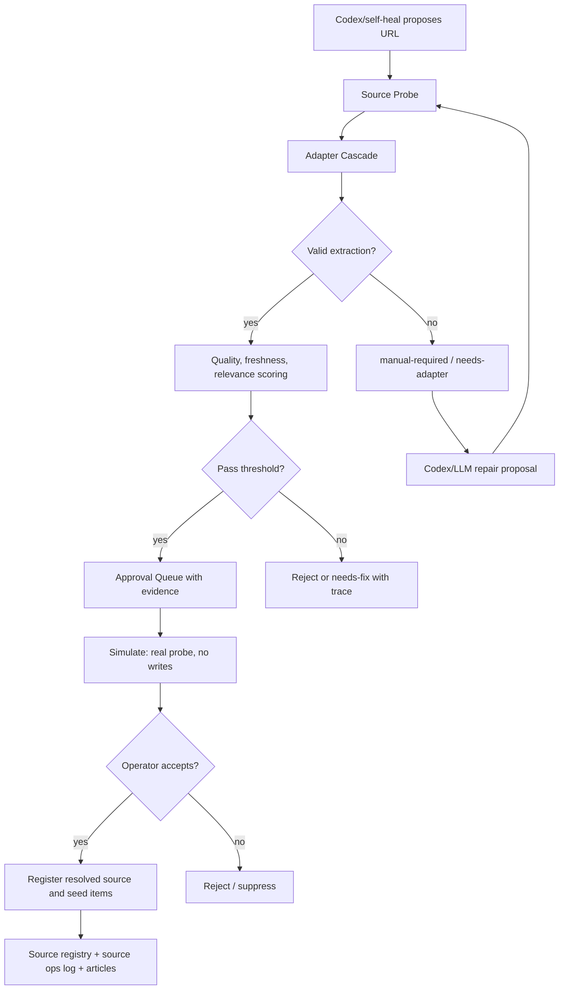

# Source Proposal And Dynamic Ingestion Redesign

> **Status**: shipped (Phase 0-6 implementation landed in commit `40745017`; source onboarding now runs through the redesigned pipeline)

Date: 2026-04-16 KST

## 2026-04-22 Runtime Hardening Update

The add-source loop was verified through the real Decision Inbox accept path rather than only through unit tests.

Confirmed behavior:

- A previously failing homepage proposal for `https://www.iata.org/` now repairs to `https://www.iata.org/api/rss/pressrelease` and executes as a registered source.
- 20 additional RSS/Atom proposals were queued, accepted through `/api/approval-queue/:id/review`, and verified as active source-registry records.
- The active source registry increased from 32 to 52 records during the smoke run.
- Each accepted proposal reached `approval_queue.status = executed` and wrote an active record to `data/persistent-cache/source-registry%3Av1.json`.
- Article seeding used actual `INSERT ... ON CONFLICT DO NOTHING` row counts, so duplicate headlines no longer inflate the visible `articleCount`.
- `queueForApproval()` is now URL-idempotent for pending and needs-fix `add-rss` items. Re-queuing the same URL updates the existing row instead of creating another operator task.
- Approval dedupe uses the same canonical URL normalization as cleanup, including trailing slash removal, so trivial URL variants do not create duplicate pending rows.
- The cleanup command `npm run cleanup:source-approvals:dry` / `npm run cleanup:source-approvals` audits and repairs historical approval noise. It reopens incorrectly executed low-quality rows, rejects duplicate open rows, and writes an audit file under `data/audits/`.
- The live NAS cleanup applied on 2026-04-22 reduced open add-rss approval items to the unresolved unique cases and removed historical duplicate clutter.
- A later 2026-04-22 cleanup hardening pass rejects stale `needs-fix` add-rss items after 96 hours when their reasoning only contains repeated probe rejects or below-threshold feed failures and no active source or successful repair evidence exists.
- `add-rss` dry-run and execution now share the same approval-gate logic, so dry-run no longer claims an untrusted or cross-domain-repaired source would directly register when execution would queue approval.
- `add-rss` dry-run no longer invokes long-running Codex/LLM source repair synchronously by default. It performs probe plus deterministic heuristic repair so Simulate remains responsive. Set `SOURCE_REPAIR_DRY_RUN_LLM_ENABLED=true` only when an operator explicitly wants slow candidate generation during dry-run.
- `add-rss` execution also avoids synchronous LLM repair unless `SOURCE_REPAIR_SYNC_LLM_ENABLED=true`. If probe and heuristic repair fail, reject/manual-adapter failures are eligible for asynchronous Codex source-code repair through `queueCodexSourceCodeRepair()`.
- `add-rss` execution now treats `probe.resolvedUrl` as canonical for article seeding. It fetches and parses the resolved RSS, Atom, sitemap, or HTML-list source first and falls back to probe samples only when the resolved source cannot be read.
- Self-heal suggestions preserve explicit `category`, `theme`, or `sourceCategory` instead of falling back to `politics`.

The source-probe relevance scorer now treats broad category labels as neutral rather than as hard keyword filters. Examples include `technology`, `defense`, `cybersecurity`, `space`, `macro`, `news`, and `politics`. Specific themes such as `war-risk insurance` still require title relevance. This prevents high-quality general feeds from being rejected only because their article titles do not repeat a broad taxonomy label.

## Executive Summary

The current source onboarding path treats many source candidates as `add-rss` proposals before proving that they are actually ingestible feeds. A homepage URL such as `https://www.hellenicshippingnews.com/` can enter the human approval queue even though the current feed quality evaluator scores it as `0.00` and would skip registration.

The required fix is twofold:

1. Add a strict pre-approval gate so only validated source candidates reach the Decision Inbox.
2. Add a dynamic Source Probe and Adapter Cascade so arbitrary URLs can be profiled and ingested with the best available strategy instead of assuming every URL is RSS.

The product goal is not "ingest every website perfectly." The product goal is:

```text
Accept any proposed URL safely.
Try appropriate extraction strategies automatically.
Register only validated sources.
Fail in a structured, visible, recoverable way when extraction is not possible.
```

## Current Problem

### Example

Current approval item:

```json
{
  "url": "https://www.hellenicshippingnews.com/",
  "name": "Interceptor Reload and Shekel Stress source",
  "theme": "defense",
  "reason": "Codex theme proposal for Interceptor Reload and Shekel Stress"
}
```

Current quality probe result for that exact URL:

```json
{
  "score": 0,
  "articleCount": 1,
  "avgTitleLength": 130,
  "languageDiversity": 1,
  "topicDiversity": 0,
  "spamRate": 0,
  "freshness": 0
}
```

This means the URL is not currently usable as an RSS feed. If accepted, execution will likely return `skipped: true` with a reason like:

```text
quality 0.00 below threshold 0.65
```

### User-Visible Symptoms

- Homepage URLs appear in the approval queue as `add-rss`.
- `Simulate` does not actually validate feed quality for `add-rss`.
- `Accept` may attempt execution only to skip registration.
- Skipped execution can still close the approval item as if work was completed.
- The approval card does not show enough preflight evidence: resolved feed URL, connector kind, sample headlines, freshness, or quality breakdown.
- The operator becomes the first real filter for bad source candidates, which is the wrong role for human review.

## Root Causes

### 1. Untrusted Candidates Bypass Quality Gate

File: `scripts/self-heal-sources.mjs`

The current flow queues untrusted URLs for approval before proving they are valid feeds. This makes human approval the first quality gate.

Current effective behavior:

```text
candidate URL
-> if untrusted
-> queueForApproval(add-rss)
-> no feed discovery
-> no quality score
-> no sample items
```

Correct behavior:

```text
candidate URL
-> Source Probe
-> Adapter Cascade
-> quality and relevance gate
-> queue only if validated
```

### 2. `add-rss` Dry Run Is Too Shallow

File: `scripts/proposal-executor.mjs`

`executeProposal()` returns a generic dry-run response for most proposal types:

```text
dry-run add-rss
```

This is not enough. For `add-rss`, dry-run must perform real network probing and parsing while blocking writes. Otherwise the UI cannot warn the user that the source would be skipped.

### 3. Skipped Execution Can Be Marked Executed

File: `scripts/event-dashboard-api.mjs`

The approval accept route executes the proposal and then marks the approval item as `executed` without treating `execution.skipped` as a non-success state. This can remove a failed or non-registered source from the review queue.

Correct behavior:

```text
execution success -> approval_queue.status = executed
execution skipped -> keep pending or mark needs-fix
execution failed -> failed/runtime issue
manual-required -> keep pending with reason
```

### 4. Feed Quality Evaluation Does Not Prove Feed Type

File: `scripts/_shared/discovered-source-registry.mjs`

The current evaluator fetches the URL and searches for title/date tags. It does not strongly verify:

- RSS root: `<rss><channel><item>`
- Atom root: `<feed><entry>`
- Content-Type
- HTML alternate feed links
- WordPress feed conventions
- sitemap/news sitemap candidates
- resolved feed URL

This is why a homepage can be evaluated as a weak pseudo-feed instead of being handled as a homepage requiring discovery.

### 5. Execution Does Not Share Resolved URL

File: `scripts/proposal-executor.mjs`

Even after quality evaluation succeeds, actual article seed insertion fetches the original URL again. If source discovery found a better feed URL, that resolved URL is not consistently used.

Correct behavior:

```text
probe inputUrl = homepage
probe resolvedUrl = actual feed URL
execution registers resolvedUrl
execution seeds articles from resolvedUrl
approval UI displays both inputUrl and resolvedUrl
```

## Target Architecture

## Two Complementary Fixes

### A. Strict Proposal Gate

This prevents bad source proposals from reaching human review.

```text
Codex/self-heal source candidate
-> Source Probe
-> quality gate
-> duplicate gate
-> theme relevance gate
-> only validated candidate enters approval queue
```

### B. Dynamic Source Ingestion

This tries to rescue arbitrary URLs by selecting an appropriate ingestion strategy.

```text
Input URL
-> profile URL and response
-> try adapters in order
-> return structured result
-> register or request manual repair
```

These are different capabilities:

```text
Strict gate = defense against bad review items.
Dynamic ingestion = ability to extract from diverse source types.
```

Both are needed.

## Target Flow



## Source Probe Contract

New shared module:

```text
scripts/_shared/source-probe.mjs
```

Suggested result shape:

```ts
type SourceConnectorKind =
  | 'rss'
  | 'atom'
  | 'html-alternate-feed'
  | 'wordpress-rss'
  | 'sitemap-news'
  | 'json-ld'
  | 'open-graph'
  | 'html-list'
  | 'playwright'
  | 'llm-selector'
  | 'manual';

type SourceProbeStatus =
  | 'success'
  | 'partial'
  | 'failed'
  | 'manual-required';

interface SourceProbeResult {
  inputUrl: string;
  resolvedUrl: string | null;
  domain: string;
  status: SourceProbeStatus;
  connectorKind: SourceConnectorKind;
  adapterTried: string[];
  qualityScore: number;
  qualityBreakdown: {
    fetchOk: boolean;
    parseOk: boolean;
    itemCount: number;
    recentItemCount: number;
    titleDiversity: number;
    duplicateRate: number;
    spamRate: number;
    language: string | null;
    themeRelevance: number;
    sourceFreshness: number;
  };
  sampleItems: Array<{
    title: string;
    url: string | null;
    publishedAt: string | null;
  }>;
  errors: Array<{
    adapter: string;
    message: string;
  }>;
  warnings: string[];
  nextAction: 'register' | 'review' | 'manual-adapter' | 'reject';
  traceId: string;
}
```

Important rule:

```text
Source Probe must never throw unhandled exceptions to callers.
Network, parser, timeout, and unsupported-source failures must become structured probe results.
```

## Adapter Cascade

The probe should try adapters in this order:

1. RSS parser.
2. Atom parser.
3. HTML alternate feed discovery via `<link rel="alternate" type="application/rss+xml">`.
4. WordPress conventions:
   - `/feed/`
   - `/rss/`
   - `/atom.xml`
   - `/category/{slug}/feed/`
   - `/wp-json/wp/v2/posts`
5. Sitemap and news sitemap:
   - `/sitemap.xml`
   - `/sitemap_index.xml`
   - `news-sitemap.xml`
6. JSON-LD Article extraction.
7. OpenGraph article metadata extraction.
8. Static HTML list/card heuristic.
9. Playwright rendered page extraction, guarded by timeout and rate limit.
10. LLM-assisted selector inference, manual approval required.
11. Manual connector required.

## Quality Gate

Default approval queue threshold:

```text
parseOk = true
recentItemCount >= 3
qualityScore >= 0.65
duplicateRate <= 0.4
spamRate <= 0.2
themeRelevance >= 0.25, unless manually overridden
```

Suggested scoring:

```text
item count:        20%
recentness:        20%
title diversity:   15%
duplicate penalty: 15%
spam penalty:      15%
theme relevance:   15%
```

The score should be explainable. The UI should show why a candidate passed or failed.

## Approval Queue Behavior

### Before

```text
URL appears in queue with basic JSON payload.
User clicks Simulate.
UI says "would execute add-rss".
User clicks Accept.
Backend discovers quality problem.
Execution skipped.
Queue may close anyway.
```

### After

```text
URL appears only after Source Probe passes.
Queue item shows input URL, resolved URL, connector kind, quality score, sample headlines, warnings.
Simulate repeats real probe with no writes.
Accept registers the resolved source and seeds from the same resolved URL.
Skipped/manual-required items remain visible as needs-fix.
```

## UI Requirements

Decision Inbox approval cards should show:

- Input URL.
- Resolved URL.
- Connector kind.
- Quality score.
- Recent item count.
- Sample headlines.
- Warnings.
- Next action.
- Whether Accept is safe.

Simulate result should show:

```text
DRY RUN
Resolved feed: ...
Connector: ...
Quality: ...
Recent items: ...
Would seed: ...
Warnings: ...
```

If `skipped`:

```text
SKIPPED - Source was not registered.
Reason: quality 0.00 below threshold 0.65.
Next: find feed URL, generate adapter, or reject.
```

The row should not disappear when skipped.

## Codex / LLM Role

Codex or an LLM should not directly register sources.

Correct LLM roles:

- Explain why a source failed probing.
- Infer possible feed URLs.
- Infer HTML selectors from a DOM sample.
- Draft a source-specific adapter patch.
- Summarize robots/paywall/license risks.
- Produce a human-reviewable connector proposal.

Incorrect LLM roles:

- Add arbitrary homepage URLs as active sources.
- Treat text extraction as proof of feed quality.
- Hide failures behind confident summaries.
- Register unverified sources without structured validation.

## Implementation Plan

### Phase 0: Shared Source Probe

Files:

- `scripts/_shared/source-probe.mjs`
- `tests/source-probe.test.mjs`

Tasks:

- Implement probe result contract.
- Implement RSS/Atom parser adapter.
- Implement HTML alternate feed discovery.
- Implement WordPress convention adapter.
- Implement sitemap adapter.
- Use fixture-based tests; do not depend on live network in tests.

Acceptance:

- Homepage fixture with alternate feed resolves to feed URL.
- Plain RSS fixture parses items.
- Non-feed HTML returns `manual-required` or `reject`, not an exception.

### Phase 1: Gate Source Proposals Before Approval

Files:

- `scripts/self-heal-sources.mjs`
- `scripts/_shared/discovered-source-registry.mjs`
- `tests/self-heal-sources.test.mjs`

Tasks:

- Run Source Probe for every candidate before `queueForApproval`.
- Queue only candidates that pass quality gate.
- Store probe metadata in approval payload.
- Log rejected/manual-required candidates to source ops or automation log.

Acceptance:

- `https://www.hellenicshippingnews.com/` homepage does not enter approval queue unless a valid resolved feed is found.
- Rejected candidates include a clear reason.

### Phase 2: Make Simulate Real

Files:

- `scripts/proposal-executor.mjs`
- `tests/proposal-executor.test.mjs`

Tasks:

- Special-case `add-rss` dry-run.
- Perform Source Probe and item extraction.
- Return quality, samples, resolved URL, and would-seed count.
- Prevent registry write, article insert, and budget consume during dry-run.

Acceptance:

- `add-rss` dry-run shows actual quality result.
- Generic `would execute add-rss` is no longer used for RSS approval simulation.

### Phase 3: Fix Approval Semantics

Files:

- `scripts/event-dashboard-api.mjs`
- `scripts/_shared/approval-queue.mjs`
- `tests/event-dashboard-approval-queue.test.mjs`

Tasks:

- Do not mark skipped execution as `executed`.
- Add or emulate `needs-fix` state.
- Return actionable failure metadata.
- Keep the row visible in the UI.

Acceptance:

- `execution.skipped=true` does not close the approval as executed.
- UI can show the item as needs-fix or failed.

### Phase 4: Use Resolved Connector For Execution

Files:

- `scripts/proposal-executor.mjs`
- `scripts/_shared/source-probe.mjs`
- `scripts/_shared/discovered-source-registry.mjs`

Tasks:

- Register `resolvedUrl`, not just original `url`.
- Seed articles from the same parsed probe items or the same resolved source.
- Store connector kind and probe trace in source registry.

Acceptance:

- Input homepage can resolve to `/feed/`.
- Registry shows both original and resolved source context.

### Phase 5: Decision Inbox UI

Files:

- `event-dashboard.html`
- `e2e/inbox-actions.spec.ts`

Tasks:

- Show input URL and resolved URL separately.
- Show quality score and sample headlines.
- Show skipped/manual-required result without removing row.
- Disable or warn on Accept when probe says reject/manual-required.

Acceptance:

- Playwright verifies skipped result remains visible.
- Playwright verifies Simulate displays probe metadata.

### Phase 6: Codex Repair Loop

Files:

- `scripts/generate-codex-investigation-packet.mjs`
- New or existing runtime issue packet tooling.
- Optional: `scripts/source-adapter-proposal.mjs`

Tasks:

- Use probe trace to generate adapter repair prompts.
- Ask Codex/LLM for selector or adapter patch.
- Route proposed connector patches through human review.

Acceptance:

- Failed source probe can produce a structured repair packet.
- No LLM output directly activates a source without approval.

## Codex / LLM Implementation Prompt

Use this prompt when assigning the implementation to Codex or another coding agent:

```text
현재 GitHub에 연결된 Lattice Current 레포에서 source proposal과 add-rss approval 흐름을 근본적으로 개선해 주세요. 목표는 두 가지입니다. 첫째, Codex나 self-heal이 제안한 source 후보가 approval queue에 올라가기 전에 실제 수집 가능한 후보인지 엄격하게 검증하는 것입니다. 둘째, 단순히 나쁜 후보를 걸러내는 데서 끝나지 않고, 임의의 URL이 들어와도 RSS, Atom, HTML alternate feed, WordPress feed, sitemap, JSON-LD, OpenGraph, static HTML list, Playwright rendered page, LLM-assisted selector inference 순서로 가능한 extraction strategy를 동적으로 탐색하는 Source Probe와 Adapter Cascade를 구현하는 것입니다.

먼저 현재 코드의 add-rss 흐름을 파일 단위로 확인해 주세요. 특히 scripts/self-heal-sources.mjs, scripts/proposal-executor.mjs, scripts/event-dashboard-api.mjs, scripts/_shared/discovered-source-registry.mjs, event-dashboard.html을 기준으로 proposal 생성, approval queue 진입, dry-run simulation, accept execution, source registry 등록, article seed insertion, UI 표시가 어떻게 이어지는지 파악해 주세요. 기존 동작 중 사용자가 만든 unrelated change는 되돌리지 말고, 새 구조와 충돌하는 부분만 최소한으로 수정해 주세요.

새로 만들 핵심 모듈은 shared source probing 계층이어야 합니다. scripts/_shared/source-probe.mjs 또는 동등한 위치에 SourceProbeResult 구조를 정의하고, inputUrl, resolvedUrl, domain, connectorKind, adapterTried, qualityScore, recentItemCount, sampleItems, errors, warnings, nextAction, trace를 반환하게 해 주세요. connectorKind는 rss, atom, html-alternate-feed, wordpress-rss, sitemap-news, json-ld, open-graph, html-list, playwright, llm-selector, manual 중 하나로 시작해 주세요. Source Probe는 절대 예외를 밖으로 터뜨리지 말고, 실패도 status failed 또는 manual-required로 구조화해서 반환해야 합니다.

Adapter Cascade는 먼저 직접 RSS/Atom 파싱을 시도하고, 실패하면 HTML을 가져와 link rel alternate의 RSS/Atom URL을 찾고, 그 다음 /feed/, /rss/, /atom.xml, /sitemap.xml, /wp-json/wp/v2/posts 같은 convention을 시도하게 해 주세요. sitemap에서는 최근 article URL 후보를 뽑고, HTML에서는 JSON-LD Article, OpenGraph article metadata, article/card list selector heuristic을 순서대로 시도해 주세요. Playwright나 LLM selector는 우선 인터페이스와 trace만 준비하고, 실제 자동 실행은 timeout, rate limit, manual approval guard 아래에서만 동작하도록 설계해 주세요.

품질 평가는 단일 점수가 아니라 breakdown을 반환해야 합니다. 최소 항목은 fetchOk, parseOk, itemCount, recentItemCount, titleDiversity, duplicateRate, spamRate, language, themeRelevance, sourceFreshness, stabilityWarnings입니다. approval queue에 올릴 기준은 기본적으로 parseOk가 true이고 recentItemCount가 3 이상이며 qualityScore가 0.65 이상이어야 합니다. 단, 신뢰도 높은 known domain이나 manual override가 있는 경우만 threshold를 완화할 수 있게 하되, 그 사유를 warnings와 reason에 남겨 주세요.

scripts/self-heal-sources.mjs는 untrusted domain을 곧바로 approval queue에 넣지 않도록 바꿔 주세요. 모든 candidate.url에 대해 Source Probe를 먼저 실행하고, probe.nextAction이 review 또는 register이고 qualityScore가 기준을 통과한 경우에만 approval_queue에 넣어 주세요. approval payload에는 inputUrl, resolvedUrl, connectorKind, qualityScore, recentItemCount, sampleItems, warnings, probeTraceId를 포함해 주세요. 기준 미달 후보는 approval queue에 넣지 말고 source ops log 또는 automation log에 rejected/manual-required/needs-adapter로 남겨 주세요.

scripts/proposal-executor.mjs의 executeProposal dryRun 처리는 add-rss에 대해 generic would execute로 끝나면 안 됩니다. add-rss dryRun은 실제 Source Probe와 quality evaluation을 수행하되, source registry write, articles insert, budget consume은 하지 않아야 합니다. dryRun 응답에는 resolvedUrl, connectorKind, qualityScore, recentItemCount, sampleItems, wouldRegister, wouldSeedCount, warnings, skipped reason을 포함해 주세요.

add-rss 실제 실행은 원래 proposal.url이 아니라 Source Probe가 반환한 resolvedUrl과 connectorKind를 사용해야 합니다. registry 등록과 article seed insertion도 같은 resolvedUrl에서 나온 parsed items를 사용하게 해 주세요. quality gate에서 skipped가 나온 경우에는 execution.skipped=true를 반환하고, event-dashboard-api.mjs는 이 경우 approval_queue 상태를 executed로 닫지 말아야 합니다. skipped 또는 manual-required는 pending 상태를 유지하거나 needs-fix에 준하는 별도 상태로 남겨 사용자가 URL 수정 또는 reject를 선택할 수 있게 해 주세요.

event-dashboard.html의 Decision Inbox UI도 변경해 주세요. approval item preview에는 input URL과 resolved URL을 분리해서 보여 주고, connectorKind, qualityScore, recentItemCount, sample headlines 3~5개, warnings, nextAction을 표시해 주세요. Simulate 버튼 결과는 실제 probe 결과를 보여줘야 하며, skipped면 명확히 “등록되지 않음”으로 표시하고 Accept 버튼을 비활성화하거나 강한 경고를 보여 주세요. Accept 후 skipped가 반환되면 row를 사라지게 하지 말고 failed 또는 needs-fix 상태로 고정해 주세요.

테스트를 반드시 추가해 주세요. homepage URL이 들어왔을 때 /feed/ 후보를 발견하는 테스트, 실제 RSS URL은 그대로 통과하는 테스트, RSS가 아닌 홈페이지가 quality 0으로 approval queue에 올라가지 않는 테스트, add-rss dryRun이 실제 quality 결과를 반환하는 테스트, execution.skipped이면 approval을 executed로 닫지 않는 API 테스트, Decision Inbox에서 skipped 결과가 row를 제거하지 않는 Playwright 테스트를 추가해 주세요. 외부 네트워크에 의존하지 않도록 fetch를 mock하거나 작은 fixture HTML/RSS/XML을 사용해 주세요.

최종 검증은 node --test로 관련 단위 테스트를 실행하고, npx playwright test e2e/inbox-actions.spec.ts를 실행하고, npm run build까지 확인해 주세요. 결과 보고에는 어떤 흐름이 기존과 달라졌는지 Before/After로 설명하고, hellenicshippingnews.com 같은 홈페이지 URL이 이제 어떻게 probe되고 approval queue에 올라가는지 또는 왜 거부되는지 예시로 보여 주세요.
```

## Acceptance Checklist

- Bad homepage URL does not silently enter approval queue as valid `add-rss`.
- Source Probe returns structured failure instead of throwing.
- Simulate performs real validation for `add-rss`.
- Approval queue card displays source evidence before Accept.
- Skipped execution does not close approval as executed.
- Execution uses `resolvedUrl`, not only original `url`.
- Source registry stores connector kind and probe trace.
- Tests cover RSS, homepage discovery, invalid homepage, dry-run validation, skipped approval semantics, and UI row retention.

## Expected Product Change

Before:

```text
The operator reviews raw URLs.
The system discovers bad candidates after Accept.
The queue can hide skipped results.
```

After:

```text
The system profiles and probes URLs first.
The operator reviews evidence-backed source candidates.
The ingestion layer dynamically chooses the best connector.
Failures become visible, repairable states.
Codex assists recovery instead of bypassing validation.
```
